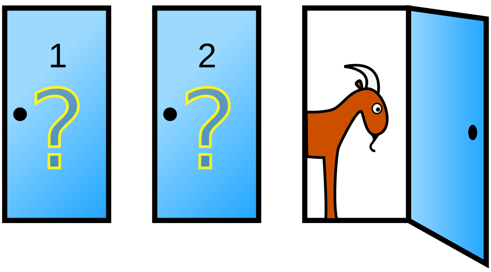

# Credits

* Chap. 2 of *Bayes Rules! An Introduction to Applied Bayesian Modeling*
  * https://www.bayesrulesbook.com/chapter-2.html


# Events

* An event is a set of outcomes of an experiment to which a probability is assigned. \bigskip

* Examples of events and probabilities related to a fair dice: \bigskip

  * $E_1$: the dice lands 4 ($P$=1/6)
  * $E_2$: the dice lands odd: 1 or 3 or 5.  ($P$=1/2)
  * $E_3$: the dice lands 2 or 4.  ($P$=1/3)

# Conditional vs unconditional probability

* Let $A$ and $B$ be two events. \bigskip

* $P(A)$:  unconditional probability of $A$. It measures the probability of observing A, without any knowledge of B. 
\bigskip

* $P(A|B)$:  conditional probability of $A$ given $B$: probability of observing $A$ once $B$ occurred (probability of $A$ *given* $B$).

# Conditional probability

* $A$ is not observed. \bigskip

* Comparing  $P(A|B)$ vs $P(A)$ reveals how the observation of $B$ informs us about  $A$. \bigskip

* $P(A|B)$ can be larger, smaller or equal to $P(A)$.

# Conditional probability

* Probability of joining an orchestra, given that one practices clarinet every day:

$$ P(\text{orchestra} \; | \; \text{practice}) > P(\text{orchestra}) $$

# Conditional probability

* Probability of getting the flu given that one washes thoroughly his hands:

$$ P(\text{flu} \; | \; \text{wash hands}) < P(\text{flu}) $$

# $P(A|B) \ne P(B|A)$

* Roughly 100% of puppies are adorable:
$$P(\text{adorable} \; | \; \text{puppy}) = 1$$

\bigskip
* But an adorable object is not necessarily a puppy:
$$ P(\text{puppy} \; | \; \text{adorable}) < 1 $$

# $P(A|B)>P(A)$?


* $A$ = you will  enjoy the newest novel from a certain author.

\bigskip


* $B$ = you just finished reading a book from the same author and you enjoyed it.

# $P(A|B)>P(A)$?

* $B$ = it’s 0 degrees Celsius tonight.

\bigskip

* $A$ = tomorrow it will be very warm.

# $P(A|B)>P(A)$?

Consider a woman who is  mother of two children. \bigskip

* $A$ = the second child will be a girl
* $B$ = the first child is a boy \bigskip


# Independent events

* $A$ and $B$ are independent if  the occurrence of $B$ doesn’t tell us anything about the occurrence of $A$:
$$P(A|B)=P(A)$$

\bigskip

* Unconditional (i.e., *marginal*) and conditional probability are identical.

\bigskip  

* For instance:
  * event $A$:  rider Q wins the next motoGP race
  * event $B$: my coin lands tails
  * Since the coin does not affect the performance of rider Q, $P(A|B)=P(A)$.


# Motivating example

* According to a study,  40% of the articles taken from a certain website are fake news and 60% are real. \bigskip

* The usage of an exclamation point in the title is however uncommon  in  real articles. 
\bigskip

  * 26.67%  of fake news titles use an exclamation point
  
  * only 2.22%  of real news titles use it.

# Bayesian knowledge-building 

* Given that an article contains the exclamation point, which is its probability of being fake news?


# Notation 
* We denote random variable with uppercase letters and their specific values by lowercase letters.

\bigskip

* Let us consider discrete variables, which have a finite set of possible outcomes.

\bigskip

* $P(Y)$:  probability distribution for variable  $Y$, i.e,  a table containing as many elements as the possible values of $Y$. \bigskip

  * If $Y$ is discrete, the distribution is also called a probability mass function (pmf). 
\bigskip

# Notation 

* Specific values are denote by lowercase; for instance, $y$. \bigskip

*  $P(y)$ denotes the probability of $P(Y=y)$, where $\sum_y p(y)=1$. \bigskip

* We use moreover the shortcut notation $P(x|y) = P(X=x \mid Y=y)$


# Prior probability 

* From now we will deal with random variables, not event.

\bigskip

* Consider the random variable $A$ (article) with possible states {*real*, *fake*}. \bigskip

* *Prior* probability, i.e.,  before having seen the  article: \bigskip
  
  *  $P(A = \text{fake})$ = 0.4 
  
  * $P(A = \text{real})$ = 0.6 

# A further random variable

* Variable $B$ refers to whether the article title contains or not an explanation point.
\bigskip

* Its possible states are {!, ~!}

# Conditional probability

*  The exclamation point in the title is more compatible with fake news than with real news.
\bigskip

*  If an article is fake,  there is  26.67% chance it uses exclamation points in the title.
  \bigskip
  
  * The conditional probability $P(!|fake)$ is 0.2667.
\bigskip

*  The conditional probability $P(!|real)$ is instead 0.0222.


# Likelihood


* The likelihood measures the  compatibility of the observation (article contains exclamation point) with the different values of the unobserved variable (article is fake or real).
\bigskip

* $P(A|b)$:  table containing the probability of the each value of $A$,  given the observation $B=b$. 

# Prior probabilities and likelihoods of fake news. 

|             | fake | real |
| ----------- | ----------- | ----------- |
| prior probability      |  $P(\text{fake})$=0.40      | $P(\text{real})$=0.6 |
| likelihood   | $P(! \mid \text{fake})$=0.26        | $P(! \mid \text{real})$=0.02 |

* Prior probabilities add up to 1 but the likelihoods do not. 
\bigskip

* The likelihood function is not a probability function; instead it is a way to measure the  compatibility of the observation (title contains !) with the different states of the unobserved variable $A$ (fake or real).

# Posterior probability that the article is fake 


* We want the posterior probability of the article being fake given that it uses exclamation points.

$$P(\text{fake} \mid !) = \frac{P(\text{fake}) P(! \mid \text{fake})}{P(!)} = \frac{ 0.4 \cdot 0.2667}{0.12} = 0.889$$.


* Notice: 

$$P(!) = 
\underbrace{
P(!\mid \text{real}) P(\text{real})}_{P(!,\text{real})} + 
\underbrace{
P(!\mid \text{fake}) P(\text{fake})}_{P(!,\text{fake})} $$

#  Bayes'  theorem - recap

* Unobserved variable $A$, whose set of possible states  is $\mathcal{A}$.

\bigskip

* Observation:  $B=b$ 

\bigskip


* Given $B=b$, the posterior probability  of $A=a$ is: 

\bigskip


\begin{align*}
 P(a|b) & = \frac{P(a)P(b \mid a)}{P(b)} = 
\frac{P(a)P(b \mid a)}{\sum_{a' \in \mathcal{A}} P(a',b)} \\
& P(b)>0
\end{align*}


# Prior 


*  $P(A)$  represents how likely are the different  values of $A$, according to our beliefs,  before we see any data.
\bigskip


# Likelihood 


* When we have a specific observation $b$, we get the likelihood $P(a|b)$ for each $a \in \mathcal{A}$. 

\bigskip

* The likelihood is not a probability distribution; it does not sum to one. 

# Marginal likelihood 
* The denominator of Bayes' rule is a normalizing constant,  referred to as the marginal likelihood.

\bigskip

* It  marginalizes the likelihood over the states of the unobserved variable $A$:
$$P(b)=\sum_{a}P(a)P(b \mid a) = \sum_{a} P(a,b)$$


# Joint probability 

|             | fake | real |
| ----------- | ----------- | ----------- |
|  !      |  |  |
| ~!   | |  |


* The joint probability $P(a,b)$ is the probability of observing 
both $A=a$ and $B=b$.
\bigskip

* We can compute it as  $$ P(a, b) = P(a|b) P(b)$$


# Joint probability


\begin{align*}
  P(\text{fake}, ! ) & = P(\text{fake}) P(! \mid \text{fake}) \\
   & = 0.4 \cdot 0.2667 = 0.1067
\end{align*}

|             | fake | real |
| ----------- | ----------- | ----------- |
|  !      | 0.1067 |  |
| ~!   | |  |


# Joint probability 

\begin{align*}
  P(\text{fake}, \sim\text{!}) & = P(\text{fake}) P(\sim\text{!} \mid \text{fake}) \\
  & = 0.4 \cdot (1 - 0.2667) = 0.2933
\end{align*}

|             | fake | real |
| ----------- | ----------- | ----------- |
| !     | 0.1067 |  |
| ~ !   | 0.2933 |  |


# Joint probability

\begin{align*}
  P(\text{real}, \text{!}) & = P(\text{real}) P(\text{!} \mid \text{fake}) \\
  & = 0.6 \cdot 0.0222 = 0.0133
\end{align*}

|             | fake | real |
| ----------- | ----------- | ----------- |
| !     | 0.1067 | 0.0133 |
| ~ !   | 0.2933 |  |

# Joint probability

\begin{align*}
  P(\text{real}, \text{no !}) & = P(\text{real}) P(\text{no !} \mid \text{fake}) \\
  & = 0.6 \cdot (1-0.0222) \\
  & =  0.6 \cdot 0.9778 = 0.5867
\end{align*}

|             | fake | real |
| ----------- | ----------- | ----------- |
| !     | 0.1067 | 0.0133 |
| ~ !   | 0.2933 | 0.5867 |

* The joint probability sums up to 1.


# Marginal distribution and marginal probability

* The marginal distribution of $A$ is obtained by summing the joint distribution over all states of  $B$.

|             | fake | real |
| ----------- | ----------- | ----------- |
|  !      | 0.1067 | 0.0133 |
| ~ !   | 0.2933 | 0.5867 |
| **marginal** | **0.4** | **0.6** |

* The marginal distribution of $A$ is {fake=0.4; real=0.6}. 
\bigskip

* Moreover, $$P(A= \text{fake}) = P(\text{fake},!) + P(\text{fake}, \sim !)$$.  


# Marginal distribution and marginal probability

* The marginal distribution of $B$ is obtained by summing the joint distribution over all states of  $A$.

|             | fake | real | **marginal**
| ----------- | ----------- | ----------- |
|  !      | 0.1067 | 0.0133 | **0.12 |
| ~ !   | 0.2933 | 0.5867 | **0.88** |


* The marginal distribution of $B$ is  {! = 0.12; ~ ! = 0.88}. \bigskip

* A randomly chosen article has 0.12 probability of containing the exclamation point in the title.

# Sum rule

* Given the joint distribution $P(X,Y)$ \bigskip

* The marginal probability  $P(X=x)$ is given by the **sum rule**
   $$ P(x) = \sum_y P(x, y)$$
   \bigskip

* The summation is over all possible values of $Y$.


# Computing marginal probabilities 

* Assume you want to compute $P(b)$ from $P(A)$ and $P(B|A)$, rather than from $P(A,B)$.
\bigskip

* The marginal  $P(B=b)$ is $P(b) =  \sum_a P(b,a) = \sum_a P(b \mid a) P(a)$.

\begin{align*}
P(\text{!}) & = P(\text{real}, \text{!}) + P(\text{fake}, \text{!}) \\
& = P(\text{real}) P(\text{!} \mid \text{real}) + P(\text{fake}) P(\text{!} \mid \text{real}) \\
& = 0.4 \cdot 0.0222 + 0.6  \cdot 0.2667 \\
& = 0.1067 + 0.0133 = 0.12
\end{align*}


# Testing for Covid 19 (Murphy, Sec 3.2.1)
*  You decide to take a diagnostic test to check if you have contracted Covid. You want to make inference about your health $H$ whose possible states are:
    * infected  
    * healthy

# The diagnostic test
The test $T$ can be either:

 * positive
 * negative

We want to determine the probability distribution $P(H|positive)$.


# Test performance: conditional probability

Assume the conditional probability of the test outcome, given an infected person, to be: \bigskip


|  | test negative | test positive |
| :-: | :-: | :-: |
| $P(T \mid \text{infected})$ | 0.125  | .875 |

\bigskip

* Thus the probability of a positive test for an infected persons is 87.5%.


# Test performance: conditional probability

Assume the conditional probability of the test outcome, given an healthy person, to be: \bigskip


|  | test negative | test positive |
| :-: | :-: | :-: |
$P( T \mid \text{healthy})$ |.975 | .025  |

* Thus the probability of a negative test for a healthy  patient, 97.5%  


# Prior 

* The *prevalence* is the percentage of persons affected by the disease.
\bigskip

* The covid prevalence  in New York City  2020 was 10%.

\bigskip


|  |  $H$=healthy | $H$=infected |
| :-: | :-: | :-: |
| probability | 0.9  | .1 |

* This is our prior, before observing the outcome of the test.

# P(infected | positive)

\begin{align*}
P( \text{infected} \mid \text{positive}) & = \frac{\overbrace{P(\text{infected})}^{\text{prior: prevalence}} 
\overbrace{P(\text{positive}|\text{infected})}^{\text{likelihood}}} { \underbrace{P(\text{positive})}_{\text{prob of observing a positive test: marginal likelihood}}} \\
\end{align*}

# Denominator, a.k.a. marginal likelihood 

* Total probability of having  a positive test:

  * probability of testing positive while infected + ...
  
  * probability of testing positive while healthy

\begin{align*}
P( \text{positive}) & = P(\text{positive, infected}) + P(\text{positive, healthy}) \\
& = P(\text{positive | infected})
P(\text{infected})
+ P(\text{positive | healthy}) P(\text{healthy})\\
& = 0.875 \times 0.1 \times + 0.025  \times 0.9 \\
& = 0.11
\end{align*}

# Posterior

\begin{align*}
P(\text{infected}|\text{positive}) & = \frac{P(\text{infected}) P(\text{positive} \mid \text{infected})}{P(\text{positive})} \\
& = \frac{ 0.1 \times 0.875}{0.11} \\
& = 0.795
\end{align*}

\bigskip

* The posterior probability of being healthy is:

$$ P(\text{healthy} \mid \text{positive})  = 1 - .795 = .205$$

* The positive  test increases your probability of being infected of about 8 times.

# Exercise

* Work out  the probability of being infected if you test negative
  * 0.014

# Yet another exercise
* We have two coins: 
  * the first coins  lands  heads or tails with equal probability
  * the second coin is rigged and always lands heads. 
  
  \bigskip
* We take one  coin at random and we get heads.  What is the probability that this coin is the rigged one?

# Solution 
Since the coins are randomly chosen, the prior is:
$$P(\text{fair})=P(\text{rigged})=0.5$$

\bigskip
The likelihood is:
\begin{align*}
P(\text{head} \mid \text{fair})   & =0.5\\
P(\text{head} \mid \text{rigged}) & =1
\end{align*}

# Solution - 2 

The posterior probability of the coin being rigged is:
\bigskip

\begin{align*}
 P(\text{rigged}\mid \text{head})  
= & \frac 
{P(\text{rigged})P(\text{head} \mid \text{rigged})}
{P(\text{head})} \\
& = 
\frac{0.5 \times 1}{P(\text{head})} 
\\
\end{align*}


# Computing the denominator

\begin{align*}
P(\text{head}) &= P(\text{head}, \text{rigged}) + P(\text{head}, \text{fair})
\\
\\
P(\text{head}, \text{rigged}) &= P(\text{head}|\text{rigged}) P(\text{rigged})\\
& = 1 \times 0.5
\\
\\
P(\text{head}, \text{fair}) &= P(\text{head}|\text{fair}) P(\text{fair})\\
& = 0.5 \times 0.5
\end{align*}

$$ P(\text{head}) =  0.5 \times 1  + 0.5 \times 0.5  =  0.75 $$

# Conclusion

The posterior probability of the coin which has landed tail to be the rigged one is: 

\begin{align*}
 P(\text{rigged}\mid \text{head})  
= & \frac 
{P(\text{rigged})P(\text{head} \mid \text{rigged})}
{P(\text{head})} \\
& = 
\frac{0.5 \times 1}{0.75} = \frac{2}{3}
\\
\end{align*}

# Your turn: Monty Python problem
```{r figurename, echo=FALSE, out.width = '45%'}

```


* You're given the choice of three doors: 
  * Behind one door is a car
  * Behind the others, goats. 

\bigskip
  
*  You pick door 1 and the host, who knows what's behind the doors, opens door 3, which has a goat. 

\bigskip

* He then says "Do you want to pick door No. 2?" Should you switch your choice?

# Solutions
##


# Solutions of the Monty Python problem

* The prior probability of each door having the car is uniform:
$$ P(D_1) = P(D_2) = P(D_3) = 1/3 $$
     
   \bigskip


* Let us assume you choose door 1 and the presenter open door 2.

\bigskip

* To update our prior beliefs, we need the conditional probabilities
of opening door 2, given that the car is behind any given door:
$$P(O_2 \mid D_1), P(O_2 \mid D_2), P(O_2 \mid D_3)$$.

# Conditional probability

* If the car is behind door 1, the presenter opens with equal probability $D_2$
or $D_3$: 
$$P(O_2 \mid D_1)=0.5$$

\bigskip


* If the car is behind door 2, the presenter will never open door 2: 
$$P(O_2 \mid D_2)=0$$

\bigskip

* If the car is behind door 3, the presenter will surely open door 2: 
$$P(O_2 \mid D_3)=1$$

     
# Posterior probability of $D_1$

\begin{align*}
P(D_1 \mid O_2) & = \frac{P(D_1) P(O_2 \mid D_1)}{P(O_2)}\\
\end{align*}

\bigskip

* The denominator is decomposed as:
$$ P(O_2) =
P(O_2 \mid D_1) P(D_1) + P(O_2 \mid D_2) P(D_2) + P(O_2 \mid D_3) P(D_3)
$$

\bigskip

* The prior probabilities of all doors are the same and they cancel out:

\begin{align*}
P(D_1 \mid O_2) & = \frac{P(O_2 \mid D_1)}
{P(O_2 \mid D_1) + P(O_2 \mid D_2)  + P(O_2 \mid D_3)}\\
& = \frac{1/2}{3/2} = 1/3
\end{align*}

# Posterior probability of $D_3$
* The posterior probability of $D_2$ is obviously 0 (it has been opened).

\bigskip

* The posterior probability of $D_2$ is thus 2/3, but let us compute it.

\bigskip

* Reusing previous computation we get:

\bigskip

\begin{align*}
P(D_3 \mid O_2) & = \frac{P(O_2 \mid D_3)}
{P(O_2 \mid D_1) + P(O_2 \mid D_2)  + P(O_2 \mid D_3)}\\
& = \frac{1}{3/2} = 2/3
\end{align*}

# Conclusions

* The optimal strategy is swapping doors as it has a 2/3 probability of  winning.

\bigskip

* In contrast, the probability of winning with the original door is 1/3.


# Further considerations (from Kevin Murphy, Sec. 2.3.2)

\bigskip

* Consider a game is played with a million doors. The contestant chooses one door, then the game show host opens 999,998 doors in such a way as not to reveal the prize, leaving the contestant’s selected door and one other door closed. 

\bigskip

* The contestant may now stick or switch. Where do you think the prize is?