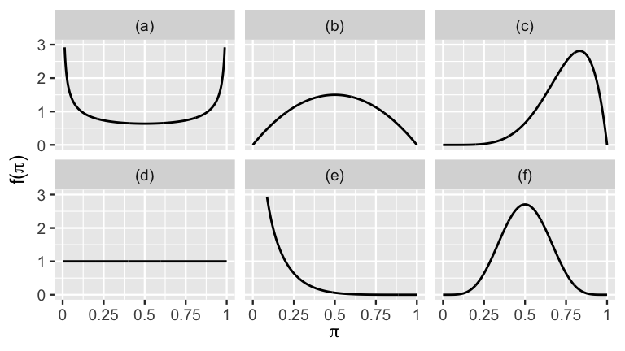
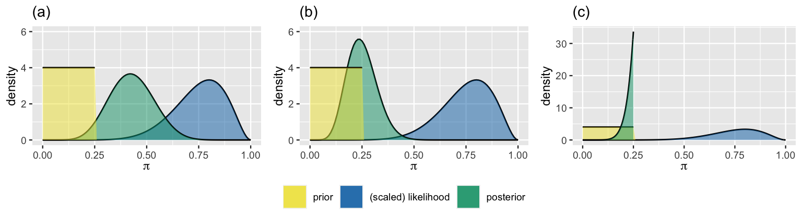

```{r setup, include=FALSE}
library(reticulate)
```

```{python, echo=FALSE}
import numpy as np
import pandas as pd
import scipy.stats as stats
from scipy.stats import beta 
from matplotlib import pyplot as plt
import seaborn as sns
sns.set_theme()
plt.rcParams.update({
    "text.usetex": True,
    "font.family": "sans-serif",
    "font.sans-serif": ["Helvetica"]})
```


```{r, include=FALSE}
knitr::opts_chunk$set(cache=TRUE)
```


# References

-   The Beta-Binomial model: Ch. 3 of `Bayes Rules! An Introduction to Applied Bayesian Modeling`
    -   <https://www.bayesrulesbook.com/chapter-3.html#chapter-3>
    -   Alicia A. Johnson, Miles Q. Ott, Mine Dogucu

# The bias $\theta$ of a coin

-   A coin falls heads with probability $\theta \in (0,1)$ \bigskip

-   $\theta$ is the *bias* of the coin

    -   $\theta$ =0: it always lands tails
    -   $\theta$ =1: it always lands heads \bigskip

-   $\theta \in (0,1)$ is a continuous parameter

# The bias $\theta$ of a coin

-   First we choose a model of our prior beliefs for each possible value of $\theta$ (*prior*).
    \bigskip

-   Then we collect some data and we express the probability of observing the data given each value of $\theta$ (*likelihood*).
    \bigskip

-   Eventually we use Bayes' rule to obtain the posterior distribution of $\theta$ given the data.

# The coin problem

-   The methodology shown in the following can be used in applications such as estimating: \bigskip

    -   the proportion of supporters of a political party \bigskip

    -   the click-through rate of an online advertisement \bigskip

    -   etc.

# Prior density for a continous parameter

-   The prior for a continuous parameter is specified by a *probability density function* (pdf), denoted by $f(\theta)$.
    \bigskip 

-   The pdf specifies all possible values of $\theta$ and the relative plausibility of each.
    \bigskip

-   It accounts for all possible values of the parameter and it integrates to 1.
    \bigskip

-   For $\theta$, the pdf is limited on (0,1)

# Properties of $f(\theta)$

-   $f(\theta) >= 0$ \bigskip

-   $\int f(\theta) d\theta = 1$ \bigskip

-   $P (a < \theta < b) = \int_a^b f(\theta) d\theta$ \bigskip

-   The underlying area between $a$ and $b$ is the probability of $\theta$ being in this range.

# Density vs probability

-   A continuous pdf is not a probability; we can also have $f(\theta) > 1$ in some points.
    \bigskip

-   Probabilities are obtained by integrating the pdf over an interval.
    \bigskip

-   $f(\theta)$ is used to compare the plausibility of different values of $\theta$ \bigskip

    -   the greater $f(\theta)$, the more plausible the corresponding value of $\theta$.


# Central tendency

-   The **mean** or **expected value** of $\theta$ is a weighted average: each possible $\theta$ value is weighted by its pdf:

$$E[\theta] = \int_x \theta \cdot f(\theta) d\theta $$

\bigskip

-   The **mode** is the value of $\theta$ at which the pdf is highest.

$$ \operatorname{Mode}(\theta) = \text{arg max}_{\theta} f(\theta)$$

# Measures of variability

-   The variance measures the expected squared distance of possible $\theta$ values from their mean:

$$\text{Var}(\theta) = E((\theta - E(\theta))^2) = \int (\theta - E(\theta))^2 \cdot f(\theta) d\theta.$$

# Standard deviation

-   The variance has squared units; the standard deviation, which measures the typical unsquared distance of $\theta$ values from $E(\theta)$, is easier to interpret.
    \bigskip

-   The standard deviation measures the expected distance of possible $\theta$ values from their mean:

$$\text{SD}(\theta) := \sqrt{\text{Var}(\theta)}$$

# The Beta pdf

-   $\text{Beta}(a, b)$, is a pdf restricted to the $(0, 1)$ interval.
    \bigskip

-   Its parameters are $a >0$ and $b>0$.
    Parameters used in prior models are referred to as *hyperparameters*.
    \bigskip

-   The pdf is:

```{=tex}
\begin{align*}
f(\theta) & = 
\frac{1} {\underbrace{B(a,b)}_{\text{normalizing constant}}}   
\theta^{a-1}(1-\theta)^ {b-1}
\propto \theta^{a-1}(1-\theta)^ {b-1} \\
&  a,b>0 \\
\end{align*}
```
\bigskip

-   $\theta$ is raised to the power of $a−1$ (not $a$)

\bigskip

-   $1-\theta$ is raised to the power of $b−1$ (not $b$)


# Central tendency measures of the Beta

```{=tex}
\begin{align*}
E(\theta) & = \frac{a}{a + b} \\
\text{Mode}(\theta) & = \frac{a - 1}{a + b - 2} \;\;\; \text{ when } \; a, b > 1. \\
\end{align*}
```
# Variability measures for Beta pdf

$$\operatorname{VAR}(\theta)= \frac{ab}{(a+b)^2(a+b+1)} $$ \bigskip

$$\operatorname{SD}(\theta)= \sqrt{\frac{ab}{(a+b)^2(a+b+1)}} $$

# Uniform distribution: $a = b = 1$

```{=tex}
\begin{align*}
f(\theta) & \propto \theta^{a-1}(1-\theta)^ {b-1} \\
& =   \theta^{0}(1-\theta)^ {0} \\
& = 1
\end{align*}
```
-   This a *uniform* distribution: all values in $(0,1)$ are equally probable.
-   $E(\theta)=\frac{a}{a+b} = 0.5$.

```{python, echo=FALSE, fig.height=2, fig.align="center"}
plt.figure(figsize=(10, 3))
x = np.linspace(0, 1, 100)

for ind, (a, b) in enumerate([(1, 1)]):
    y = stats.beta.pdf(x, a, b)
    #plt.subplot(1, 3, ind+1)
    plt.plot(x, y, label='a = %s\nb = %s' % (a, b))
    plt.legend(fontsize=12)
```

# Increasing $a$ and $b$ the prior becomes more concentrated

-   We increase both $a$ and $b$ satisfying $a=b$.
-   The pdf becomes more concentrated around the expected value $\theta=0.5$.

```{python, echo=FALSE, fig.height=2, fig.align="center"}
plt.figure(figsize=(10, 3))
x = np.linspace(0, 1, 100)

for ind, (a, b) in enumerate([(2, 2), (5, 5), (10, 10)]):
    y = stats.beta.pdf(x, a, b)
    plt.subplot(1, 3, ind+1)
    plt.plot(x, y, label='a = %s\nb = %s' % (a, b))
    plt.legend(fontsize=12)
```

# If we think the coin is rigged

-   If we suspect the coin has 70% chance of landing heads, we set $a=\frac{7}{3}b$.

-   We represent more confidence in this statement by setting $a=\frac{7}{3}b$ and increasing $b$.

```{python, echo=FALSE, fig.height=3, cache=TRUE, fig.align="center"}
plt.figure(figsize=(10, 3))
x = np.linspace(0, 1, 100)

for ind, (a, b) in enumerate([(7, 3), (28, 12), (70, 30)]):
    y = stats.beta.pdf(x, a, b)
    plt.subplot(1, 3, ind+1)
    plt.plot(x, y, label='a = %s\nb = %s' % (a, b))
    plt.legend(fontsize=12)
```

# How the density changes with $a$ and $b$

```{r foo, out.width="80%", fig.cap="Mean: solid. Mode: dashed.", echo=FALSE}
knitr::include_graphics("beta-tuning-1.png")
```

# Quiz yourself

-   When $a = b$, the pdf is: \bigskip

    -   Right-skewed, with a mode greater than 0.5.
    -   Symmetric with mode 0.5.
    -   Left-skewed with mode smaller than 0.5.

    \bigskip

-   Using the same options as above, discuss the pdf when $a > b$.

\bigskip

-   Which pdf has greater variability: Beta(20,20) or Beta(5,5)?

# Effect of $a$ and $b$

-   $a > b$: the distribution is right-skewed, the mode is larger than 0.5; vice versa for $b > a$.
    \bigskip

-   $a = b$: symmetric distribution with mean 0.5.
    \bigskip

-   Increasing $a$ and $b$ decreases the variance.

# $a$ and/or $b$ \textless 1: convex density

Consider $a$ = $b$ = 0.5
\begin{align*}
f(\theta) \propto \theta^{a-1}  (1-\theta)^{b-1} \\
f(\theta) \propto \theta^{-0.5}  (1-\theta)^{-0.5} \\
f(\theta) \propto \frac{1}{\sqrt{\theta}}  
 \frac{1}{\sqrt{1-\theta}}\\
\end{align*}


```{python, echo=FALSE, fig.height=3, cache=TRUE, fig.align="center"}
plt.figure(figsize=(10, 3))
x = np.linspace(0, 1, 100)

for ind, (a, b) in enumerate([(0.5, 5), (0.5, 0.5), (5, 0.5)]):
    y = stats.beta.pdf(x, a, b)
    plt.subplot(1, 3, ind+1)
    plt.plot(x, y, label='a = %s\nb = %s' % (a, b))
    plt.legend(fontsize=12)
```

# Quiz

-   Recognize Beta(0.5,0.5), Beta(1,1), Beta(2,2), Beta(6,6), Beta(6,2), Beta(0.5,6).

```{r, out.width="80%", echo=FALSE}

```

# Tuning $a$ and $b$

-   The support for a politician is at about 70 percentage points, though he recently polled between 45 and 90 points.
    \bigskip

-   We set the ratio $a/b$ as follows:

```{=tex}
\begin{align*}
\frac{a}{a+b}  & = .7 \\
a & = \frac{7}{3} b
\end{align*}
```
\bigskip

-   Feasible pairs of values are for instance (7,3), (14,6), etc.

# Tuning $a$ and $b$

-   We check how the 5-th and the 95-th quantile vary with $a$ and $b$

```{python, echo=TRUE, fig.height=3, fig.align="center", cache=TRUE}
from scipy.stats import beta
q1 = beta.ppf(q=[0.05,0.95],a=7, b=3)
q2 = beta.ppf(q=[0.05,0.95],a=28, b=12)
q1
q2
```

# Tuning $a$ and $b$

-   We try different couples ($a,b$, $a=\frac{7}{3}b$) to match the variance.

| (a,b)          | (7, 3) | (28, 12) | (70, 30) |
|----------------|-------:|---------:|---------:|
| 5-th quantile  |   0.45 |     0.58 |     0.62 |
| 95-th quantile |   0.90 |     0.81 |     0.77 |

-   The choice (7, 3) captures the mean and the variability of the polls in this example. Other choices yield too narrow a distribution.

# Tune a Beta prior!

-   Tune a Beta prior for the cases below:\bigskip

    -   John applies to a job.
        He thinks I has a 40% chance of getting the job, but he is pretty unsure; he expresses his uncertainty by putting his chance between 20% and 60%.
        \bigskip


-   There is no single correct prior, but multiple reasonable answers.

# The Binomial data model

-   After having defined the pdf, the second step of our Bayesian analysis is to collect data.
    \bigskip

-   We also define the likelihood function, to be used within Bayes' rule.
    \bigskip

-   In our example, the data collection is done by tossing the coin $n$ times and observing the number $y$ of heads.

# Likelihood: assumptions

-   Each observation takes a binary value (head or tail; also referred to as *success* and *insuccess*) \bigskip

-   The *success* usually refer to the rarer event among the two.
    \bigskip

-   The flips are independent: the probability of *heads* at the next flip does not depend on the outcome of the previous flips.
    \bigskip

-   The success probability $\theta$ is constant in all flips.


# The binomial distribution

Given $\theta$, a single flip takes: \bigskip

-   *heads* with probability $\theta$ \bigskip

-   *tails* with probability $1-\theta$ \bigskip

-   Assuming a constant $\theta$ and the independence of the flips, the sequence $$H \quad T  \quad T \quad H \quad H$$ has probability $$ \theta (1-\theta) (1-\theta) \theta \theta = \theta^3 (1-\theta)^2$$

-   In general, a sequence containing $y$ heads in $n$ flips has probability $$\theta^y (1-\theta)^{n-y}$$

- We assume a fixed number $n$ of trials.

# Binomial distribution

-   We can get $\binom{n}{y} = \frac{n!}{y!(n-y)!}$ sequences containing $y$ successes in $n$ trials.
    \bigskip

$$ P(y|\theta) = \binom{n}{y} \theta^y (1-\theta)^{n-y}$$


\bigskip

*   This is probability of the observing $y$ heads within $n$ flips, given the value of $\theta$.


# The binomial distribution - quiz

* Toni Kukoc played for Chicago Bulls in  the 90s

\bigskip

* In his career, his 3-point  rate is 31%.

\bigskip

* In a match against Orlando Magic, he realized 6 out of 8 shoots. 

\bigskip

* Which is the probability of him repeating or improving this performance?

# The binomial distribution - quiz
\begin{align*}
P(X=6) &= \binom{8}{6} .31^6 \cdot .69^2 = 0.011 \\
P(X=7) &= \binom{8}{7} .31^7 \cdot .69 = 0.002 \\
P(X=8) &= \binom{8}{8} .31^8 \cdot .69^0  =  .31^8 = 0.00005 \\
P(X=6) & + P(X=7) + P(X=8) = 0.013 \approx 1/77
\end{align*}

* A similar performance can be repeated about every 77 matches, that is about once for season.

# Checking assumptions

Discuss whether the assumptions of the binomial model are satisfied:
\bigskip

* $\theta$ is the same for every shoot 

\bigskip

* the outcome of the different shoots is independent from each other

  * Yes, see Tversky, A., and Gilovich, T. “The cold facts about the hot hand in basketball,” Chance 2 (1) 16–21 (1989).

\bigskip

* Kukoc will  shoot exactly 8 times in every future game. 

\bigskip

# Binomial likelihood

* So far, we assumed $\theta$ to be fixed and the data to be random. Thus used the binomial to evaluate the plausibility of a certain number of successes given a fixed $\theta$

\bigskip

* From now on, we will instead interpret it as a likelihood.
We will keep the data fixed (these are the data we observed)
and we will interpret it as a function  of $\theta$, to assess which values of $\theta$ are more likely to have generated the observed outcome.

# The Beta-binomial model

```{=tex}
\begin{align*}
\theta & \sim \text{Beta}(a, b). \\
y | \theta & \sim \text{Bin}(n, \theta) \\
\end{align*}
```
-   This model applies to any setting where parameter $\theta$ lies in [0,1] \bigskip
    -   requires tuning of a Beta prior
    -   assumes data $y$ to be the number of "successes" in $n$  independent trials with constant probability of success $\theta$.

# Binomial likelihood

-   Assume we observe $y$=6 in $n$=10 flips.
    \bigskip

-   The likelihood measures the relative compatibility of the observed data with different $\theta \in [0,1]$.
    \bigskip

-   According to the data $\theta$=0.6 is ten times more plausible than $\theta$=0.3:

```{=tex}
\begin{align*}
p(y=6,\; n=10 \mid \theta=0.6) & =
\binom{10}{6} 0.6^6 (0.4)^{4} = 0.35 \\
p(y=6,\; n=10, \mid \theta=0.3) & =
\binom{10}{6} 0.3^6 (0.7)^{4} = 0.037 \\
\end{align*}
```


# Binomial likelihood


\bigskip

-   This a *likelihood* function if interpreted in this way: \bigskip

    -   the probability is a function of $\theta$.
    -   the observation $y$ are fixed \bigskip

-   The likelihood function shows how the probability of the observed data varies with $\theta$.
    \bigskip

-   It does not integrate to 1 over all values of $\theta$!
    \bigskip

# Binomial likelihood

$$p(y \mid \theta) = \binom{n}{y} \theta^y (1 − \theta)^{1−y}$$

- It integrates to 1 if we keep $\theta$ fixed and we integrate over possible outcomes $y$. 

\bigskip

- Instead, the likelihood function treats  the observed data as fixed 
and let $P(y \mid \theta)$ vary with $\theta$.

# Posterior

-   Adopting a beta prior and a binomial *likelihood*, Bayes' rule yields a beta *posterior* density with updated parameters.

\bigskip

-   We use $f$ rather than $p$ as it represents a density.

```{=tex}
\begin{align*}
f(\theta) & \propto \theta^{a-1} (1-\theta)^{b-1} && \text{Beta prior}\\
p(y \mid \theta) & \propto \theta^{y} (1-\theta)^{n-y} && \text{Binomial likelihood} \\
f(\theta \mid y) & \propto  \theta^{y+a-1} (1-\theta)^{n-y+b-1} && \text{Beta posterior}\\
\end{align*}
```
The beta prior is *conjugate* with the binomial likelihood, as we obtain a posterior Beta pdf.

# Conjugacy

-   The Beta-binomial model is **conjugate**.
    \bigskip

-   The prior is conjugated with the likelihood if the posterior has the same functional form of the prior.
    \bigskip

-   Historically, problems in Bayesian statistics were restricted to the use of conjugate priors, because of mathematical tractability.
    \bigskip

-   Modern computational techniques allow Bayesian analysis without conjugacy, allowing the resurgence of Bayesian statistics in recent years.

# The posterior is a compromise of prior and likelihood

-   Given the prior Beta($a$,$b$), the prior mean of $\theta$ is: $$\frac{a}{a+b}$$ \bigskip

-   Having observed $y$ tails in $n$ flips, the posterior pdf of $\theta$ is Beta($y+a$,$n-y+b$).
    \bigskip

-   The posterior mean of $\theta$ is: $$E_{\text{post}}[\theta]=\frac{a + y}{a + y + b + n - y} = \frac{a + y}{a+ b + n} $$ \bigskip

# The posterior is a compromise of prior and likelihood

-   Rearranging:

$$
\underbrace{\frac{a + y}{a+ b + n}}_{\text{posterior}} =
\underbrace{\frac{y}{n}}_{\text{observed proportion}}
\underbrace{\frac{n}{a+b+n}}_{\text{weight}} +
\underbrace{\frac{a}{a+b}}_{\text{prior mean of $\theta$}}
\underbrace{\frac{a+b}{a+b+n}}_{\text{weight of the prior}}
$$

\bigskip

-   The posterior mean is a weighted average of the prior mean and the observed proportion.

\bigskip

-   The weight of the observed proportion increases with $n$; the weight of the prior mean increases with $a$ and $b$.

# The posterior is a compromise of prior and likelihood

$$
\underbrace{\frac{a + y}{a+ b + n}}_{\text{posterior}} =
\underbrace{\frac{y}{n}}_{\text{observed proportion}}
\underbrace{\frac{n}{n+a+b}}_{\text{weight}} +
\underbrace{\frac{a}{a+b}}_{\text{prior mean of $\theta$}}
\underbrace{\frac{a+b}{n+a+b}}_{\text{weight of the prior}}
$$

-   We can interpret the prior as representing an imaginary sample, containing $a$ successes and $b$ insuccesses.

\bigskip

-   The larger $a$ and $b$, the larger the imaginary sample; thus our confidence in the prior increases.

# Test yourself!

-   Let $\theta$ denote the proportion of people that prefer dogs to cats.
-   You express your prior beliefs by a Beta(7, 2) model.

\bigskip

-   According to your prior, what are reasonable values for $\theta$ ?

\bigskip

-   In a survey 19 out of 20 people prefer dogs.

\bigskip

-   How would that change your understanding about the mean and the certainty of $\theta$?

# Sequential updating

-   Based on some theoretical studies, a scientist summarizes its belief in the chance $\theta$ of a new drug being able to cure a disease as Beta(1,10) distribution.
    \bigskip

-   In an experimental trial, the drug cures 13/20 persons.
    \bigskip

-   What's the posterior distribution of $\theta$ after the first experiment?
    \bigskip

-   In a second experiment, the drug cures 20/40 persons.
    \bigskip

-   What's the posterior distribution of $\theta$ after the second experiment?

# Sequential updating

-   Prior: Beta(1,10), $E[\theta]= \frac{1}{11} = 0.09$ \bigskip

-   After first experiment: \bigskip

    -   $f(\theta|D_1) = \text{Beta}(1+13,10+7)$ \bigskip
    -   $E[\theta]= \frac{14}{14+17} = 0.45$ \bigskip
    -   Thus Beta(14,17) becomes the prior before analyzing the data of the second experiment. \bigskip

# Sequential updating

-   After second experiment:
    -   Beta(14+20,17+20)
    -   $E[\theta]= \frac{34}{34+37} = 0.48$ \bigskip

# Impact of the prior on the posterior

-   It is useful to consider different priors: priors encode domain expertise, and different experts provide you with reasonable but different assessment.

\bigskip

-   For instance:

```{python, echo=FALSE, fig.height=3, fig.align="center"}
plt.figure(figsize=(10, 3))
x = np.linspace(0, 1, 200)

for ind, (a, b) in enumerate([(1, 1), (2, 8), (5, 5)]):
    y = stats.beta.pdf(x, a, b)
    plt.subplot(1, 3, ind+1)
    plt.plot(x, y, linewidth=2)
    plt.title('Beta(%s, %s)' % (a,b))
```

# The posterior is prior-sensitive with small data (example: $y$=1, $n$=2)

```{python, echo=FALSE, fig.height=1, fig.align='center'}
plt.figure(figsize=(10, 3))
x = np.linspace(0, 1, 250)
heads=1
tails=1
for ind, (a, b) in enumerate([(1, 1), (2, 8), (5, 5)]):
    y = stats.beta.pdf(x, a+heads, b+tails)
    plt.subplot(1, 3, ind+1)
    plt.plot(x, y, linewidth=2)
    plt.title('Beta(%s+%s , %s+%s)' % (a,heads,b,tails))
    plt.legend(fontsize=12)
```

# The posterior becomes similar with more data (10 tails, 12 heads)

```{python, echo=FALSE, fig.height=1, fig.align='center'}
plt.figure(figsize=(10, 3))
x = np.linspace(0, 1, 250)
heads=10
tails=12
for ind, (a, b) in enumerate([(1, 1), (2, 8), (5, 5)]):
    y = stats.beta.pdf(x, a+heads, b+tails)
    plt.subplot(1, 3, ind+1)
    plt.plot(x, y, linewidth=2)
    plt.title('Beta(%s+%s , %s+%s)' % (a,heads,b,tails))
    plt.legend(fontsize=12)
```

# When data is larger, the posterior is the same whatever the prior

```{python, echo=FALSE, fig.height=1, fig.align='center'}
plt.figure(figsize=(10, 3))
x = np.linspace(0, 1, 200)
heads=500
tails=495
for ind, (a, b) in enumerate([(1, 1), (2, 8), (5, 5)]):
    y = stats.beta.pdf(x, a+heads, b+tails)
    plt.subplot(1, 3, ind+1)
    plt.plot(x, y, linewidth=2)
    plt.title('Beta(%s+%s , %s+%s)' % (a,heads,b,tails))
```

Posterior means $E_{\text{post}}[\theta]$ obtained from different priors:

-   $\frac{500+1}{500+1+495+1}=\frac{501}{997}=0.502$ \bigskip

-   $\frac{500+2}{500+2+495+8}=\frac{502}{1005}=0.499$ \bigskip

-   $\frac{500+5}{500+5+495+5}=\frac{505}{1005}=0.502$ \bigskip

-   Also the posterior variances are practically identical.

# Test your self!

For each scenario of the next slide, identify whether

-   the prior has more influence on the posterior

\bigskip

-   the data has more influence on the posterior

\bigskip

-   the posterior is an equal compromise between the data and the prior.

# Test your self!

-   Prior: $\theta \sim$ Beta(1,4), data: $y$=8, $n$=10

\bigskip

-   Prior: $\theta \sim$ Beta(20,3), data: $y$=0, $n$=1

\bigskip

-   Prior: $\theta \sim$ Beta(4,2), data: $y$=1, $n$=3

\bigskip

-   Prior: $\theta \sim$ Beta(20,2), data: $y$=10, $n$=200


# Sensitivity to the prior

-   With a large amount of data, the posterior is practically the same with any prior, but how much data is needed varies with the problem.
    \bigskip

-   If we only have few data, the posterior can differ depending on the adopted prior; it makes sense to repeat the analysis with different priors (*sensitivity*).
    \bigskip

-   This is sensible: the prior encodes our previous knowledge and different experts could have different priors.

# Discussion

-   Priors and likelihood are assumptions which are part of the model.
    \bigskip

-   Flat priors provide no information (uninformative priors) and should be avoided.
    \bigskip

-   *Slightly informative* priors are recommended.
    \bigskip

-   In many cases we known that the parameter can only be positive, or its order of magnitude, etc. \bigskip

-   For instance a Beta(1,1) prior is flat but limits the possible values of $\theta$ between 0 and 1.

# Priors need a broad support

-   In the following slides we discuss some problem which arise if the support of the prior is too small.

\bigskip

-   The *support* of a pdf is the set of points where the pdf is \textgreater 0.

# Priors need a broad support

-   Bayesian analysis looses its benefits is the prior pdf has a too small support, i.e. it assigns a prior probability of zero also to plausible parameter values.

\bigskip

-   For instance a priori we assume $\pi$ to equally likely be anywhere between 0 and 0.25 and that surely it doesn't exceed 0.25: $$ \pi \sim \text{Unif} (0, 025)$$

\bigskip

-   And assume to observe $y$=8 successes in $n$=10 trials.

# Priors need a broad support

-   The prior pdf, the scaled likelihood and the posterior are shown below. Which is correct plot?

```{r, out.width="95%", echo=FALSE, cache=TRUE}

```

# Priors need a broad support

-   The correct plot is the third.

\bigskip

```{r, out.width="80%", echo=FALSE, cache=TRUE}

```

-   The support of the posterior is inherited from the support of the prior.

\bigskip

-   Thus both prior and posterior assigns zero probability to any $\pi$ \textgreater 0.25. the posterior model must also assign zero probability to any value in that range.

\bigskip

-   No matter how much evidence we will collect, the posterior pdf will be truncated beyond the 0.25 cap.

# How to avoid a regrettable prior

-   Let $\pi$ be the parameter of interest.

\bigskip

-   Be sure to assign non-0 pdf to every *possible* value of $\pi$.

\bigskip

-   For example, if $\pi$ is a proportion which can range from 0 to 1, the prior model should be defined on this range.

# Conclusions

-   We have seen how Bayesian inference works when Bayes' rule can be solved analytically (conjugacy).
    \bigskip

-   Only simple likelihood functions have conjugate priors.
    \bigskip

-   Complex models have no conjugate priors and requires numerical Markov chain Monte Carlo (MCMC) to get the posterior.

# Solution of exercises 3.9 and 3.10 (https://www.bayesrulesbook.com/chapter-3.html#exercises-2)

* plot and summarize the  Beta(8,2) and the Beta(1,20) prior

```{python, echo=FALSE, fig.height=2, fig.align="center"}
plt.figure(figsize=(10, 3))
x = np.linspace(0, 1, 100)

for ind, (a, b) in enumerate([(8, 2), (1, 20)]):
    y = stats.beta.pdf(x, a, b)
    plt.subplot(1, 2, ind+1)
    plt.plot(x, y, label='a = %s\nb = %s' % (a, b))
    plt.legend(fontsize=12)
```
# Code of the previous plot

```{python, echo=TRUE, fig.height=2, fig.align="center", eval=FALSE}
plt.figure(figsize=(10, 3))
x = np.linspace(0, 1, 100)

for ind, (a, b) in enumerate([(8, 2), (1, 20)]):
    y = stats.beta.pdf(x, a, b)
    plt.subplot(1, 2, ind+1)
    plt.plot(x, y, label='a = %s\nb = %s' % (a, b))
    plt.legend(fontsize=12)
```

# Summarize the Beta (8,2)
```{python, echo=TRUE, fig.height=2, fig.align="center"}
rv = beta.rvs(a=8, b=2, size=1000)
pd.Series(rv).describe(percentiles=[0.05,0.25,0.50,0.75,0.95])
```

# Summarize the Beta (1,20)
```{python, echo=TRUE, fig.height=2, fig.align="center"}
rv = beta.rvs(a=1, b=20, size=1000)
pd.Series(rv).describe(percentiles=[0.05,0.25,0.50,0.75,0.95])
```

# Likelihood function: $y$=12, $n$=50

```{python, echo=TRUE, fig.height=2, fig.align="center"}
from scipy.stats import binom
plt.figure(figsize=(10, 3))
theta = np.linspace(0, 1, 100)

#binomial probability mass function for each theta
lik = binom.pmf(12, n=50, p=theta)
```
# Prior [Beta(8,2)], likelihood and posterior [Beta(20,40)]
```{python, echo=FALSE, fig.height=3, fig.align="center"}
from scipy.stats import binom
plt.figure(figsize=(10, 3))
theta = np.linspace(0, 1, 100)

#prior
prior = stats.beta.pdf(x, a, b)
plt.subplot(1, 3, 1)
plt.plot(x, y, label='Prior: a = %s\nb = %s' % (a, b))
plt.legend(fontsize=12)

#likelihood
lik = binom.pmf(12, n=50, p=theta)
plt.subplot(1, 3, 2)
plt.plot(theta, lik, label='likelihood')
plt.legend(fontsize=12)

#posterior
a_post=20
b_post=40
posterior = stats.beta.pdf(x, a_post, b_post)
plt.subplot(1, 3, 3)
plt.plot(theta, posterior, label='Posterior: a = %s\nb = %s' % (a, b))
plt.legend(fontsize=12)
```

# Comparing the two posteriors: Beta(8,2) and Beta(13,58)

* They are similar even though the priors were strongly different.
 
```{python, echo=FALSE, fig.height=2, fig.align="center"}
plt.figure(figsize=(10, 3))
x = np.linspace(0, 1, 100)

for ind, (a, b) in enumerate([(20, 40), (13, 58)]):
    y = stats.beta.pdf(x, a, b)
    plt.subplot(1, 2, ind+1)
    plt.plot(x, y, label='a = %s\nb = %s' % (a, b))
    plt.legend(fontsize=12)
```
