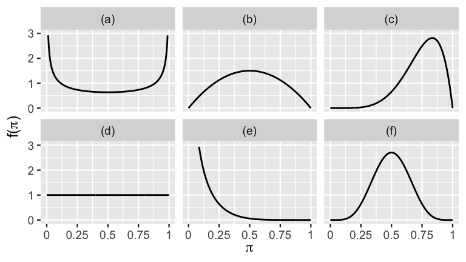

```{r setup, include=FALSE}
library(reticulate)
```

```{python, echo=FALSE}
import numpy as np
import pandas as pd
import arviz as az
import scipy.stats as stats
from scipy.stats import beta 
from matplotlib import pyplot as plt
import seaborn as sns
sns.set_theme()
plt.rcParams.update({
    "text.usetex": True,
    "font.family": "sans-serif",
    "font.sans-serif": ["Helvetica"]})
az.style.use('arviz-darkgrid')
```


# References
* The Beta-Binomial model: Ch. 3 of `Bayes Rules! An Introduction to Applied Bayesian Modeling`
  * https://www.bayesrulesbook.com/chapter-3.html#chapter-3
  * Alicia A. Johnson, Miles Q. Ott, Mine Dogucu

# The bias $\theta$ of a coin
* A coin falls tails with probability $\theta \in [0,1]$ 
* $\theta$ is  the *bias*  of the coin
  * $\theta$ =0: it always lands tails
  * $\theta$ =1: it always lands heads

* $\theta \in (0,1)$  is a continuous parameter 
 
# The bias $\theta$ of a coin

* First we choose a model of our prior beliefs for each possible value of $\theta$ (*prior*).
\bigskip

* Then we collect some  data and we express the probability of observing the data given each value of $\theta$ (*likelihood*).
\bigskip

* Eventually we use Bayes' rule to obtain the posterior distribution of $\theta$ given the data.
 


# The coin problem

* The methodology shown in the following can be used in  applications such as estimating: 
\bigskip

  *   the proportion of supporters of a political party 
  \bigskip
  
  *  the click-through rate of an online advertisement.

# Setting the prior

# The Beta prior

* The prior for a continuous parameter is specified by a *probability density function* (pdf), denoted by $f(\theta)$. \bigskip 

* The pdf specifies all possible values of $\theta$ and the relative plausibility of each. 
\bigskip

* It  accounts for all possible values of the parameter and it integrates to  1.
\bigskip

* For $\theta$, the pdf is limited on (0,1)

# Properties $f(\theta)$

* $f(\theta) >= 0$ \bigskip

* $\int f(\theta) d\theta = 1$ \bigskip

* $P (a < \theta < b) = \int_a^b f(\theta) d\theta$ \bigskip

* The underlying area between $a$ and $b$ is the probability of $\theta$ being in this range.

# Density vs probability

* A continuous pdf is not  a probability; 
we can also have $f(\theta) > 1$ in some points.
\bigskip

* Probabilities are obtained by integrating the pdf over an interval. \bigskip

* $f(\theta)$ is used to compare the plausibility of  different values of $\theta$
\bigskip

  * the greater $f(\theta)$, the more plausible the corresponding value of $\theta$.

# The Beta pdf

* $\text{Beta}(a, b)$, is a pdf  restricted to the $[0, 1]$ interval. 
\bigskip

* Its parameters are $a >0$ and $b>0$. Parameters used in prior models are referred to as 
 *hyperparameters*.
\bigskip

* The pdf  is:

\begin{align*}
f(\theta) & = 
\frac{1} {\underbrace{B(a,b)}_{\text{normalizing constant}}}   
\theta^{a-1}(1-\theta)^ {b-1}
\propto \theta^{a-1}(1-\theta)^ {b-1} \qquad \qquad a,b>0 
\end{align*}


*  $\theta$ is raised to the power of $a−1$  (not  $a$)
\bigskip
*  $1-\theta$ is raised to the power of $b−1$  (not  $b$)


  
# Central tendency 

* The **mean** or **expected value** of $\theta$ is a weighted average: each possible $\theta$ value is weighted by its  pdf:

$$E[\theta] = \int_x x \cdot f(x) dx $$
  
* The **mode** is the value of $\theta$ at which the pdf is highest.

$$ \operatorname{Mode}(\theta) = \text{arg max}_{\theta} f(\theta)$$

# Measures of variability
* The variance  measures the expected squared distance of possible $\theta$ values from their mean:


$$\text{Var}(\theta) = E((\theta - E(\theta))^2) = \int (\theta - E(\theta))^2 \cdot f(\theta) d\theta.$$


# Standard deviation

* The variance  has squared units; the standard deviation, which measures the typical unsquared distance of \(\pi\) values from \(E(\pi)\), is easier to interpret.
\bigskip

* The standard deviation  measures the  expected distance of possible $\theta$ values from their mean:

$$\text{SD}(\pi) := \sqrt{\text{Var}(\pi)}$$


# Central tendency measures of the Beta 

\begin{align*}
E(\theta) & = \frac{\alpha}{\alpha + \beta} \\
\text{Mode}(\theta) & = \frac{\alpha - 1}{\alpha + \beta - 2} \;\;\; \text{ when } \; \alpha, \beta > 1. \\
\end{align*}

# Variability measures for Beta pdf

$$\operatorname{VAR}(\theta)= \frac{ab}{(a+b)^2(a+b+1)} $$

$$\operatorname{SD}(\theta)= \sqrt{\frac{ab}{(a+b)^2(a+b+1)}} $$

# Effect of the parameters
```{r foo, out.width="80%", fig.cap="Mean: solid. Mode: dashed.", echo=FALSE}

```

# Quiz yourself

* When $\alpha = \beta$, the pdf is:  \bigskip
    * Right-skewed, with a mode smaller than 0.5.
    * Symmetric with  mode  0.5.
    * Left-skewed with mode  greater than 0.5.
    
  \bigskip
  

* Using the same options as above, discuss the pdf  when $\alpha > \beta$.

\bigskip
* Which pdf has greater variability: Beta(20,20) or Beta(5,5)?


# Effect of $a$ and $b$
* $a > b$:  the distribution is right-skewed,  the mode is larger than 0.5;
vice versa for  $b > a$.
\bigskip

* $a = b$: symmetric distribution with mean 0.5.
\bigskip

* Increasing $a$ and $b$ decreases the variance.


# Uniform distribution: $a = b = 1$

\begin{align*}
f(\theta) & \propto \theta^{a-1}(1-\theta)^ {b-1} \\
& =   \theta^{0}(1-\theta)^ {0} \\
& = 1
\end{align*}

* This a *uniform* distribution: all values in $(0,1)$ are equally probable.
* $E(\theta)=\frac{a}{a+b} = 0.5$.

```{python, echo=FALSE, fig.height=2, fig.align="center"}
plt.figure(figsize=(10, 3))
x = np.linspace(0, 1, 100)

for ind, (a, b) in enumerate([(1, 1)]):
    y = stats.beta.pdf(x, a, b)
    #plt.subplot(1, 3, ind+1)
    plt.plot(x, y, label='a = %s\nb = %s' % (a, b))
    plt.legend(fontsize=12)
```


# Increasing $a$ and $b$ the prior becomes more concentrated

* If we increase both $a$ and $b$ while keeping $a=b$, the prior becomes more concentrated around the expected value $\theta=0.5$


```{python, echo=FALSE, fig.height=2, fig.align="center"}
plt.figure(figsize=(10, 3))
x = np.linspace(0, 1, 100)

for ind, (a, b) in enumerate([(2, 2), (5, 5), (10, 10)]):
    y = stats.beta.pdf(x, a, b)
    plt.subplot(1, 3, ind+1)
    plt.plot(x, y, label='a = %s\nb = %s' % (a, b))
    plt.legend(fontsize=12)
```

# If we think the coin is rigged towards *tails*


* If we suspect the coin to be 70% rigged towards heads, we set $a=\frac{7}{3}b$.

* We represent more  confidence in this statement by:
  * increasing $b$
  * keeping  $a=\frac{7}{3}b$.

```{python, echo=FALSE, fig.height=3, cache=TRUE, fig.align="center"}
plt.figure(figsize=(10, 3))
x = np.linspace(0, 1, 100)

for ind, (a, b) in enumerate([(7, 3), (28, 12), (70, 30)]):
    y = stats.beta.pdf(x, a, b)
    plt.subplot(1, 3, ind+1)
    plt.plot(x, y, label='a = %s\nb = %s' % (a, b))
    plt.legend(fontsize=12)
```


# Which Beta?

*  Recognize Beta(0.5,0.5), Beta(1,1), Beta(2,2), Beta(6,6), Beta(6,2), Beta(0.5,6).

```{r, out.width="80%", echo=FALSE}

```

# Tuning  $a$ and $b$

* The support for a politician is at about 70 percentage points, though he recently polled as low as 45 and as high as 90 percentage points.

* We set the ratio $a/b$ as follows: **RIVEDI**

\begin{align*}
\frac{a}{a+b}  & = .7 \\
a & = .7 a + .7 b  \\
a & = \frac{9}{11} b
\end{align*}


# Tuning  $a$ and $b$

* We try different couples ($a,b$) with the same expected value in order to set correctly the variance of the prior.

| (a,b)          	| (7, 3) 	| (28, 12) 	| (70, 30) 	|
|----------------	|-------:	|---------:	|---------:	|
| 5-th quantile  	|   0.45 	|     0.58 	|     0.62 	|
| 95-th quantile 	|   0.90 	|     0.81 	|     0.77 	|

* The choice (7, 3) captures the mean and the variability of the polls and it is appropriate.

<!-- # Computing the quantiles of the beta with Python -->

<!-- * **do not show results!** -->

<!-- ```{python, echo=TRUE, fig.height=3, cache=TRUE, fig.align="center"} -->
<!-- for (a, b) in  [(7, 3), (28, 12), (70, 30)]: -->
<!--     quantiles=[0.05, 0.95] -->
<!--     q = beta.ppf(quantiles, a=a, b=b) -->
<!--     print("a=", a , " b=", b, ", q05=", q[0], ", q95=", q[1]) -->
<!-- ``` -->


# Tune a Beta prior!

* Tune a Beta prior for the cases below:\bigskip

    * John applies to a job. He thinks I has a 40% chance of getting the job, but he is pretty unsure; he expresses his uncertainty by putting his chance between 20% and 60%.
    \bigskip

    * A scientist has created a new test for a disease. He expects that the test is accurate 80% of the time with a variance of 0.05. \bigskip

* Usually there is no single right answer, but  multiple reasonable answers.


# The likelihood function

# The Binomial data model

* After having defined the prior pdf, the second step of our Bayesian analysis is to collect data. \bigskip

* We need defining the likelihood function, which will be used within Bayes' rule.
\bigskip

* In our example, the data collection is done by tossing the coin $n$ times and observing the number $y$ of heads.

# Likelihood: assumptions

* Each observation takes a binary value (head or tail; also referred to as *success* and *insuccess*) \bigskip

* The *success* usually refer to the rarer event among the two. \bigskip

* The flips are independent: the probability of  *heads* at the next flip does not depend on the outcome of the previous flips. \bigskip

* The success probability $\theta$ is constant in all flips.


# The binomial likelihood

Given $\theta$, a single flip takes:

* *heads* with probability $\theta$ \bigskip
* *tails* with probability $1-\theta$ \bigskip

* Assuming a constant $\theta$ and the independence of the flips, the  sequence
$H \quad T  \quad T \quad H \quad H$
has probability
$$ \theta (1-\theta) (1-\theta) \theta \theta = \theta^2 (1-\theta)^3$$

* A sequence containing $y$ heads in  $n$ flips has probability
$\theta^y (1-\theta)^{n-y}$

# Binomial likelihood

* We can get $\binom{n}{y} = \frac{n!}{k!(n-y)!}$ sequences containing $y$ successes in $n$ trials. \bigskip

* The probability of observing  $y$ successes in $n$ trials is:
$$p(y \mid \theta) = \binom{n}{y} \theta^y (1 − \theta)^{1−y}$$
\bigskip

* This is probability of the observing $y$ tails within $n$ flips, given the value of  $\theta$.

# The Beta-binomial model
\begin{align*}
\theta & \sim \text{Beta}(\alpha, \beta). \\
y | \theta & \sim \text{Bin}(n, \theta) \\
\end{align*}

* This model has vast applications, applying to any setting where parameter  $\theta$ lies in [0,1] \bigskip
  *  requires tuning of a Beta prior 
  *  assumes data $y$ to be the number of “successes” in $n$ fixed, independent trials with constant probability of success $\theta$.

# Binomial likelihood

* Assume we observe $y$=6 in $n$=10 flips. \bigskip

* The likelihood measures the relative compatibility of the observed  data  with different $\theta \in [0,1]$. \bigskip

* According to the data $\theta$=0.6 is ten times more plausible than  $\theta$=0.3:

\begin{align*}
\text{Bin}(y=6,\; n=10 \; \theta=0.6) & =
\binom{10}{6} 0.6^6 (0.4)^{4} = 0.35 \\
\text{Bin}(y=6,\; n=10 \; \theta=0.3) & =
\binom{10}{6} 0.3^6 (0.7)^{4} = 0.037 \\
\end{align*}


# Binomial likelihood

$$p(y \mid \theta) = \binom{n}{y} \theta^y (1 − \theta)^{1−y}$$

\bigskip

* This a *likelihood* function if interpreted in this way: \bigskip
  * the  probability is a function of $\theta$.
  * the  observation $y$ are  fixed
 \bigskip

* The likelihood function shows how the probability of the observed data varies with $\theta$. \bigskip

* It does not integrate to 1!
 \bigskip

* It integrates to 1 if $\theta$ is fixed, providing a pdf over possible observations $y$.

# Posterior

Adopting a beta prior and a binomial  *likelihood*, Bayes' rule yields   a beta *posterior* distribution with updated parameters:

\begin{align*}
p(\theta) & \propto \theta^{a-1} (1-\theta)^{b}\\
p(y \mid \theta) & = \theta^{y} (1-\theta)^{n-y} \\
p(\theta \mid y) & \propto  \theta^{y+a-1} (1-\theta)^{n-y+b-1}\\
\end{align*}

The beta prior is *conjugate* with the binomial likelihood, as we obtain a beta posterior.

# Conjugacy
According to Bayes' theorem, the posterior is the product of the likelihood and the prior:
$$
p(\theta \mid y) \propto p(y \mid \theta) p(\theta)
$$
In our case:

\begin{align*}
p(\theta \mid y) & \propto \theta^y (1-\theta)^{n-y}
\theta^{a-1} (1-\theta)^{b-1}\\
p(\theta \mid y) & \propto \theta^{y+a-1} (1-\theta)^{n-y+b-1}
\end{align*}

which is a Beta distribution (without expressing the normalization constant).

# The posterior is a compromise of prior and likelihood

* Given the prior Beta($a$,$b$), the prior mean of $\theta$ is: $$\frac{a}{a+b}$$
\bigskip

* Having observed $y$ tails in $n$ flips, the posterior distribution of $\theta$ is Beta($y+a$,$n-y+b$). \bigskip

* The posterior mean is:
$$E_{\text{post}}[\theta]=\frac{a + y}{a + y + b + n - y} = \frac{a + y}{a+ b + n} $$
\bigskip

# The posterior is a compromise of prior and likelihood

* Rearranging:
$$
\underbrace{\frac{a + y}{a+ b + n}}_{\text{posterior}} =
\underbrace{\frac{y}{n}}_{\text{observed proportion}}
\underbrace{\frac{n}{n+a+b}}_{\text{weight}} +
\underbrace{\frac{a}{a+b}}_{\text{prior mean of $\theta$}}
\underbrace{\frac{a+b}{n+a+b}}_{\text{weight of the prior}}
$$

* The posterior mean is a weighted average of the  prior mean and the observed proportion.
\bigskip

* The weight of the observed proportion increases with $n$; the weight of the prior mean  increases with $a$ and $b$.


# Sequential updating

* Based on some theoretical studies, a scientist summarizes its belief in the chance $\theta$ of a new drug being able to cure a disease as Beta(1,10) distribution.
\bigskip

* In an experimental trial, the drug cures  13/20 persons.
\bigskip

* In a second experiment, the drug cures 20/40 persons.
\bigskip

* What’s the posterior distribution of $\theta$ after the first experiment?
\bigskip

* What’s the posterior distribution of $\theta$ after the second experiment?
\bigskip

# Sequential updating

* Prior: Beta(1,10), $E[\theta]= \frac{1}{11} = 0.09$ \bigskip

* After first experiment: Beta(1+13,10+20), $E[\theta]= \frac{14}{44} = 0.32$ \bigskip
  * Thus Beta(14,30) becomes the prior before analyzing the data of the second experiment.
\bigskip

* After second experiment: Beta(14+20,30+40), $E[\theta]= \frac{34}{104} = 0.33$ \bigskip

# Conjugacy

* The Beta-binomial model is **conjugate**.
\bigskip

* The prior is conjugated with the likelihood if the posterior has the same functional form of the prior.
\bigskip

* Historically, problems in Bayesian statistics were restricted to the use of  conjugate priors, because of  mathematical tractability.
\bigskip

* Modern computational techniques allow Bayesian analysis without conjugacy,  allowing the resurgence of Bayesian statistics in recent years.

# Aggiungere esercizio da Bayes rule!!


# Computation == RIVEDERE DA QUI
* In the course we will see how to use computational methods to compute the posteriori even with non-conjugate priors.

* In the following we exploit conjugacy in order to explor the sensitivity of the posterior on the prior.


# Impact of the prior on the posterior

* We can start from different priors depending on subjective beliefs (priors  might be used to encode domain expertise, and different experts would provide you with reasonable but different assessment)

* Let us consider different priors
```{python, echo=FALSE, fig.height=3, fig.align="center"}
plt.figure(figsize=(10, 3))
x = np.linspace(0, 1, 200)

for ind, (a, b) in enumerate([(1, 1), (2, 8), (5, 5)]):
    y = stats.beta.pdf(x, a, b)
    plt.subplot(1, 3, ind+1)
    plt.plot(x, y, linewidth=2)
    plt.title('Beta(%s, %s)' % (a,b))
```

# The posterior depends on the priors when observations are few ($y$=1 tails, $n$=2,  heads=1)
```{python, echo=FALSE, fig.height=1, fig.align='center'}
plt.figure(figsize=(10, 3))
x = np.linspace(0, 1, 250)
heads=1
tails=1
for ind, (a, b) in enumerate([(1, 1), (2, 8), (5, 5)]):
    y = stats.beta.pdf(x, a+heads, b+tails)
    plt.subplot(1, 3, ind+1)
    plt.plot(x, y, linewidth=2)
    plt.title('Beta(%s+%s , %s+%s)' % (a,heads,b,tails))
    plt.legend(fontsize=12)
```

* The Beta(2,8) represents the following beliefs:
  * expected value = $\frac{2}{2+8}=0.2$
  *
```{python echo=TRUE, fig.align='center', fig.height=1}
from scipy.stats import beta
quantiles=[0.05, 0.25, 0.5, 0.75, 0.95]
q = beta.ppf(quantiles, a=2, b=8)
print(q)
```


# The posterior becomes similar as we observe more data (10 tails, 12 heads)
```{python, echo=FALSE, fig.height=1, fig.align='center'}
plt.figure(figsize=(10, 3))
x = np.linspace(0, 1, 250)
heads=10
tails=12
for ind, (a, b) in enumerate([(1, 1), (2, 8), (5, 5)]):
    y = stats.beta.pdf(x, a+heads, b+tails)
    plt.subplot(1, 3, ind+1)
    plt.plot(x, y, linewidth=2)
    plt.title('Beta(%s+%s , %s+%s)' % (a,heads,b,tails))
    plt.legend(fontsize=12)
```


# When the number of observations is large, the posterior is the same whatever the prior
```{python, echo=FALSE, fig.height=1, fig.align='center'}
plt.figure(figsize=(10, 3))
x = np.linspace(0, 1, 200)
heads=500
tails=495
for ind, (a, b) in enumerate([(1, 1), (2, 8), (5, 5)]):
    y = stats.beta.pdf(x, a+heads, b+tails)
    plt.subplot(1, 3, ind+1)
    plt.plot(x, y, linewidth=2)
    plt.title('Beta(%s+%s , %s+%s)' % (a,heads,b,tails))
```

The posterior means $E_{\text{post}}[\theta]$ are practically identical for any prior:

* $\frac{500+1}{500+1+495+1}=\frac{501}{997}=0.502$ \bigskip
* $\frac{500+2}{500+2+495+8}=\frac{502}{1005}=0.499$ \bigskip
* $\frac{500+5}{500+5+495+5}=\frac{505}{1005}=0.502$ \bigskip

* Also the posterior variances are practically identical.


# The posterior mean is just part of the information

* Bayesian analysis yieldsthe posterior  distribution of $\theta$,  **not** a single value.
\bigskip

* The dispersion of the posterior is a measure of our  uncertainty.
\bigskip

* The uncertainty decreases when we have more data.
\bigskip

# Sensitivity to the prior

* With a  large amount of data, the posterior is practically the same with any  prior,
but how much data is needed varies with the problem. \bigskip

* If we only have few data, the posterior can differ depending on the adopted prior; it makes sense to repeat the analysis with different priors (*sensitivity*).
\bigskip

* This is sensible:  the prior  encodes our previous knowledge and different experts could have different priors.


# Discussion
* Priors and likelihood are  assumptions which are  part of the model.
\bigskip

* Flat priors  provide no information (uninformative priors) and  should be avoided.
\bigskip

* *Slightly informative*  priors are recommended. 
\bigskip

* In many cases we known that the parameter  can only be positive, or its order of magnitude, etc. \bigskip


* For instance a Beta(1,1) prior is flat but limits the  possible values of $\theta$ between 0 and 1.

# Conclusions

* We have seen  how Bayesian inference works when Bayes’ rule can be solved analytically (conjugacy). \bigskip

* Only simple likelihood functions have conjugate priors. \bigskip

* Complex models have no conjugate priors and requires  numerical Markov chain Monte Carlo (MCMC) to get the posterior.