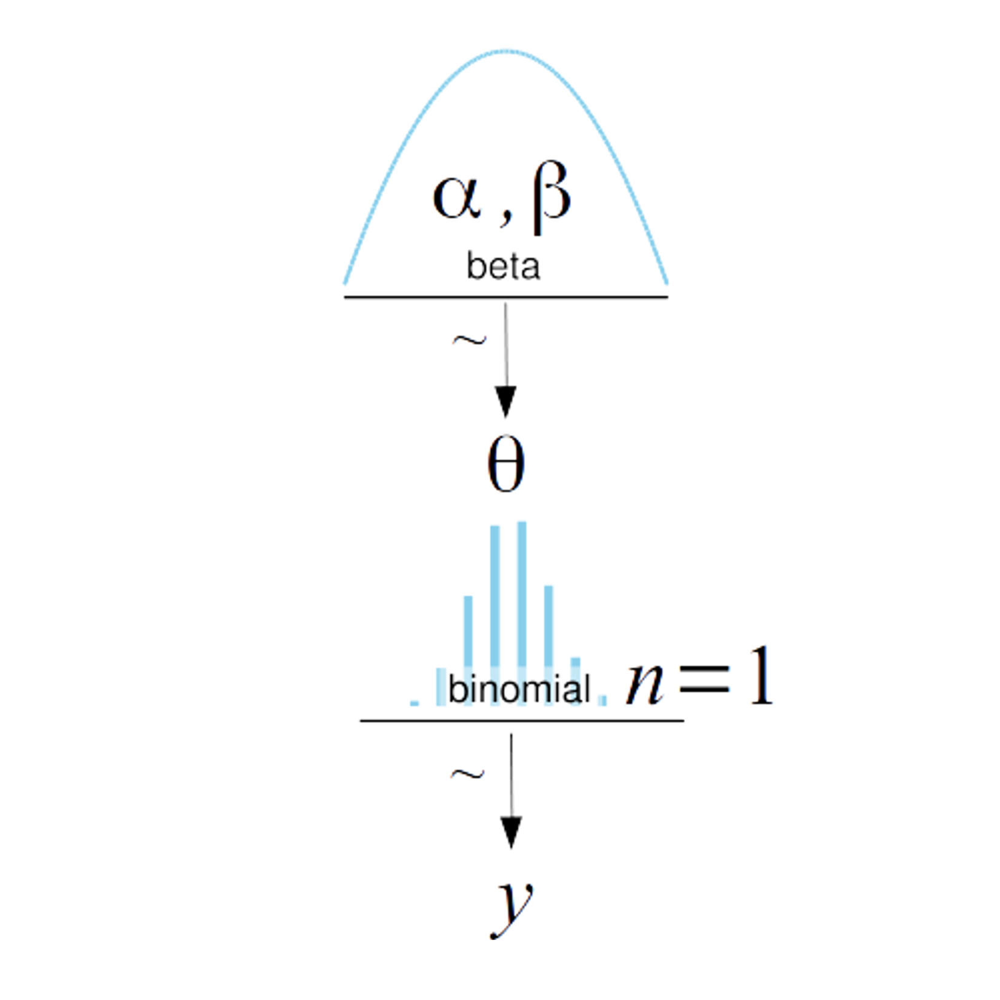

```{r setup, include=FALSE}
library(reticulate)
use_condaenv("r-reticulate")
```

```{python, echo=FALSE}
import numpy as np
from scipy.stats import beta
import pandas as pd
import arviz as az
import scipy.stats as stats
from matplotlib import pyplot as plt
import seaborn as sns
sns.set_theme()
plt.rcParams.update({
    "text.usetex": True,
    "font.family": "sans-serif",
    "font.sans-serif": ["Helvetica"]})
az.style.use('arviz-darkgrid')
```

# The coin problem
* A coin falls tails with probability $\theta \in [0,1]$ 
* $\theta$ is  the *bias*  of the coin
  * $\theta$ =0: it always lands tails
  * $\theta$ =1: it always lands heads
 
* We  flip the coin $n$ times and we measure the number of heads $y$. 
* Which is the posterior distribution $p(\theta \mid y)$?

# The coin problem

* The coin  stands in for a real-world application, such as estimating the success probability of a drug, the probability of a person being left handed, etc

**Assumptions**

* Each observation can take only binary values (success / insuccess)
* Each observation is independent from the others: the probability of getting *heads* at the next flip does not depend on the outcome of the previous flip
* $\theta$ is constant in all flips.


# The coin problem
A single flip takes:

* *heads* with probability $\theta$
* *tails* with probability $1-\theta$

* Under the previous assumptions, the probability of the sequence:
$$H \quad T  \quad T \quad H \quad H$$

* is $\theta^2 (1-\theta)^3$
* A sequence of length $n$, containing $y$ heads, has probability 
$$\theta^y (1-\theta)^{n-y}$$

# Binomial Likelihood function for a set of binary flips

$$p(y \mid \theta) = \theta^y (1 − \theta)^{1−y}$$

* This is probability of the observing $y$ tails given  $\theta$. 
* Different values of $\theta$ yield different probabilities of the observed data.
* The observation $y$ is fixed, while $\theta$ is a continuous unknown variable.
* Seen as a function of $\theta$, this a *likelihood* function.
  * The likelihood function is not a probability distribution and it does not integrate to 1 if we integrate it over $\theta$
  * This a probability distribution if we assume $\theta$ fixed, the probability to vary as a function of $y$ and we integrate the function over the possible observations $y$.


# The prior $p(\theta)$
* We need to define the prior probability of each value of $\theta$ in $[0, 1]$.

* The beta distribution, denoted by $\text{Beta}(a, b)$, is a suitable prior for   variables restricted to the $[0, 1]$ interval. 

* The density function  is:

\begin{align*}
p(\theta) & = 
\frac{1} {\underbrace{B(a,b)}_{\text{normalizing constant}}}   
\theta^{a-1}(1-\theta)^ {b-1}
\propto \theta^{a-1}(1-\theta)^ {b-1} \qquad \qquad a,b>0 
\end{align*}

* Let us ignore the normalizing constant. 

Note that:

*  $\theta$ is raised to the power of $a−1$  (not  $a$)
*  $1-\theta$ is raised to the power of $b−1$  (not  $b$)

# Beta distribution
* Expectation (i.e., mean): 
$$E(\theta)= \frac{a}{a+b} $$
* Variance: 
$$\operatorname{VAR}(\theta)= \frac{ab}{(a+b)^2(a+b+1)} $$

* Higher $a$:  the bulk of the distribution moves rightward
* Higher $b$: the bulk of the distribution moves leftward 
* Higher $a$ and $b$:  the  distribution gets more concentrated.

# Beta distribution with $a = b = 1$

\begin{align*}
p(\theta) & \propto \theta^{a-1}(1-\theta)^ {b-1} \\
& =   \theta^{0}(1-\theta)^ {0} \\
& = 1
\end{align*}

* This a *uniform* distribution: all values in $(0,1)$ are equally probable.
* $E(\theta)=\frac{a}{a+b} = 0.5$.

```{python, echo=FALSE, fig.height=2, fig.align="center"}
plt.figure(figsize=(10, 3))
x = np.linspace(0, 1, 100)

for ind, (a, b) in enumerate([(1, 1)]):
    y = stats.beta.pdf(x, a, b)
    #plt.subplot(1, 3, ind+1)
    plt.plot(x, y, label='a = %s\nb = %s' % (a, b))
    plt.legend(fontsize=12)
```


# Increasing $a$ and $b$ the prior becomes more concentrated

* If we increase $a$ and $b$ together, the prior becomes more concentrated around the expected value $\theta=0.5$ 

* We can thus represent  more confident beliefs  about  the coin being fair

```{python, echo=FALSE, fig.height=2, fig.align="center"}
plt.figure(figsize=(10, 3))
x = np.linspace(0, 1, 100)

for ind, (a, b) in enumerate([(2, 2), (5, 5), (10, 10)]):
    y = stats.beta.pdf(x, a, b)
    plt.subplot(1, 3, ind+1)
    plt.plot(x, y, label='a = %s\nb = %s' % (a, b))
    plt.legend(fontsize=12)
```

# If we think the coin is rigged towards *tails*


* If we suspect the coin to be 70% rigged towards heads, we set $a=\frac{7}{3}b$.

* We represent more  confidence in this statement by:
  * increasing $b$
  * keeping  $a=\frac{7}{3}b$. 

```{python, echo=FALSE, fig.height=3, cache=TRUE, fig.align="center"}
plt.figure(figsize=(10, 3))
x = np.linspace(0, 1, 100)

for ind, (a, b) in enumerate([(7, 3), (28, 12), (70, 30)]):
    y = stats.beta.pdf(x, a, b)
    plt.subplot(1, 3, ind+1)
    plt.plot(x, y, label='a = %s\nb = %s' % (a, b))
    plt.legend(fontsize=12)
```

# Choice of  $a$ and $b$
* The choice of $a$ and $b$ can be fine-tuned if you have an idea about the quantiles of your prior beliefs, not only the expected value.
* This is how the 10-the and the 90-th percentile vary with $a$ and $b$:

```{python, echo=TRUE, fig.height=3, cache=TRUE, fig.align="center"}
for (a, b) in  [(7, 3), (28, 12), (70, 30)]:
    quantiles=[0.10, 0.90]
    q = beta.ppf(quantiles, a=a, b=b)
    print("a=", a , " b=", b, ", q10=", q[0], ", q90=", q[1])
```

# We suspect the coin to be rigged but we do not in which direction

* $a<1, b<1$ yield a convex distribution
* As they get closer to 0, the distribution becomes even more  convex: we are now modelling the opinion that  the coin is  unlikely to be fair

```{python, echo=FALSE, fig.height=3, cache=TRUE, , fig.align="center"}
plt.figure(figsize=(10, 3))
x = np.linspace(0, 1, 100)

for ind, (a, b) in enumerate([(0.7, 0.3), (0.5, 0.5), (0.3, 0.7)]):
    y = stats.beta.pdf(x, a, b)
    plt.subplot(1, 3, ind+1)
    plt.plot(x, y, label='a = %s\nb = %s' % (a, b))
    plt.legend(fontsize=12)
```

# Discussion
The beta distribution can represent different types of prior beliefs  
about $\theta$, such as:

* all  values of $\theta$ are equally probable a priori 
* we think the coin is likely to be fair, but we are not fully sure (bell centered in $\theta$=0.5).
* we think the coin is likely to be rigged towards tails  (asymmetric distribution centered in e.g. $\theta$=0.7, less or more concentrated).
* we  think the coin to be  rigged, but she does not know in which way (convex distribution).

 
# Posterior
Adopting a beta prior for $\theta$ and a binomial distribution as *likelihood*, we obtain  a beta *posterior* distribution with updated parameters:

\begin{align*}
p(\theta) & \propto \theta^{a-1} (1-\theta)^{b}\\
p(y \mid \theta) & = \theta^{y} (1-\theta)^{n-y} \\
p(\theta \mid y) & \propto  \theta^{y+a-1} (1-\theta)^{n-y+b-1}\\
\end{align*}

The beta prior is *conjugate* with the binomial likelihood, as we obtain a beta posterior.

# Conjugacy
According to Bayes' theorem, the posterior is the product of the likelihood and the prior:
$$
p(\theta \mid y) \propto p(y \mid \theta) p(\theta)
$$
In our case:

\begin{align*}
p(\theta \mid y) & \propto \theta^y (1-\theta)^{n-y}
\theta^{a-1} (1-\theta)^{b-1}\\
p(\theta \mid y) & \propto \theta^{y+a-1} (1-\theta)^{n-y+b-1}
\end{align*}

which is a Beta distribution (without expressing the normalization constant).

# The posterior is a compromise of prior and likelihood

* Given the prior Beta($a$,$b$), the prior mean of $\theta$ is: $$\frac{a}{a+b}$$
* Having observed $y$ tails in $n$ flips, the posterior distribution of $\theta$ is Beta($y+a$,$n-y+b$).
The posterior mean is:
$$E_{\text{post}}[\theta]=\frac{a + y}{a + y + b + n - y} = \frac{a + y}{a+ b + n} $$

* Rearranging:
$$ 
\underbrace{\frac{a + y}{a+ b + n}}_{\text{posterior}} = 
\underbrace{\frac{y}{n}}_{\text{observed proportion}}
\underbrace{\frac{n}{n+a+b}}_{\text{weight}} + 
\underbrace{\frac{a}{a+b}}_{\text{prior mean of $\theta$}}
\underbrace{\frac{a+b}{n+a+b}}_{\text{weight of the prior}}  
$$

* The posterior mean is a weighted average of the  prior mean and the observed proportion. 
* The weight of the observed proportion increases with $n$; the weight of the prior mean  increases with $a$ and $b$.

# Conjugacy

* If for a certain _likelihood_ the functional form of the _a priori_ and that of the _a posteriori_ coincide, it is said that the _a priori_ is conjugated with the _likelihood_. 


* Historically, problems in Bayesian statistics were restricted to the use of  conjugate priors, because of  mathematical tractability.

* However modern computational techniques allow obtaining posteriors even when conjugacy does not hold,  allowing the resurgence of Bayesian statistics in recent years. 

# Representing the Beta-binomial model
We represent the model as:
\begin{align*}
\theta & \sim \operatorname{Beta}(a,b)\\
y & \sim \operatorname{Bin}(n,\theta)
\end{align*}

The symbol $\sim$ shows the distribution followed by a certain variable.

# Kruschke diagram of the beta binomial model

* In the top level we show the prior, below  the likelihood, and finally the data. 

```{r, echo=FALSE, fig.height=2, fig.align='center'}

```

# Exercise: grid sampling (DISCUTERE CON MARCO)

* Choose a value of $\theta$ and simulate 1000 Bernoulli trials from it; 
collect the value of $n$ and $y$
* Define your prior by setting $a$ and $b$ (do not abuse the fact that you know $\theta$)
* Discretize the values of $\theta \in (0,1)$ by 0.01
* Compute for each value of $\theta$ the unnormalized posterior 
$p(\theta | mid y) \propto Beta(\theta;a,b) p(y \mid \theta) $
* Check the following:
  * given the large sample size, your posterior remains practically the same if you change the prior
  * given to the large sample size, your posterior is concentrated around the true values of $\theta$
  * your posterior is practically equivalent to $Beta(\theta;a+y,b+n-y)$ also for small sample size.

# CODE TO BE IMPLEMENTED


# Computation
* In the course we will see how to use computational methods to compute the posteriori even with non-conjugate priors.

* In the following we exploit conjugacy in order to explor the sensitivity of the posterior on the prior.


# Impact of the prior on the posterior

* We can start from different priors depending on subjective beliefs (priors  might be used to encode domain expertise, and different experts would provide you with reasonable but different assessment)

* Let us consider different priors
```{python, echo=FALSE, fig.height=3, fig.align="center"}
plt.figure(figsize=(10, 3))
x = np.linspace(0, 1, 200)

for ind, (a, b) in enumerate([(1, 1), (2, 8), (5, 5)]):
    y = stats.beta.pdf(x, a, b)
    plt.subplot(1, 3, ind+1)
    plt.plot(x, y, linewidth=2)
    plt.title('Beta(%s, %s)' % (a,b))
```

# The posterior depends on the priors when observations are few ($y$=1 tails, $n$=2,  heads=1)
```{python, echo=FALSE, fig.height=1, fig.align='center'}
plt.figure(figsize=(10, 3))
x = np.linspace(0, 1, 250)
heads=1
tails=1
for ind, (a, b) in enumerate([(1, 1), (2, 8), (5, 5)]):
    y = stats.beta.pdf(x, a+heads, b+tails)
    plt.subplot(1, 3, ind+1)
    plt.plot(x, y, linewidth=2)
    plt.title('Beta(%s+%s , %s+%s)' % (a,heads,b,tails))
    plt.legend(fontsize=12)
```

* The Beta(2,8) represents the following beliefs:
  * expected value = $\frac{2}{2+8}=0.2$
  *
```{python echo=TRUE, fig.align='center', fig.height=1}
from scipy.stats import beta
quantiles=[0.05, 0.25, 0.5, 0.75, 0.95]
q = beta.ppf(quantiles, a=2, b=8)
print(q)
```

  

# The posterior becomes similar as we observe more data (10 tails, 12 heads)
```{python, echo=FALSE, fig.height=1, fig.align='center'}
plt.figure(figsize=(10, 3))
x = np.linspace(0, 1, 250)
heads=10
tails=12
for ind, (a, b) in enumerate([(1, 1), (2, 8), (5, 5)]):
    y = stats.beta.pdf(x, a+heads, b+tails)
    plt.subplot(1, 3, ind+1)
    plt.plot(x, y, linewidth=2)
    plt.title('Beta(%s+%s , %s+%s)' % (a,heads,b,tails))
    plt.legend(fontsize=12)
```


# When the number of observations is large, the posterior is the same whatever the prior 
* The likelihood overwhelms the prior f
```{python, echo=FALSE, fig.height=1, fig.align='center'}
plt.figure(figsize=(10, 3))
x = np.linspace(0, 1, 200)
heads=500
tails=495
for ind, (a, b) in enumerate([(1, 1), (2, 8), (5, 5)]):
    y = stats.beta.pdf(x, a+heads, b+tails)
    plt.subplot(1, 3, ind+1)
    plt.plot(x, y, linewidth=2)
    plt.title('Beta(%s+%s , %s+%s)' % (a,heads,b,tails))
```

The posterior means $E_{\text{post}}[\theta]$ obtained using the different priors are:

* $\frac{500+1}{500+1+495+1}=\frac{501}{997}=0.502$
* $\frac{500+2}{500+2+495+8}=\frac{502}{1005}=0.499$
* $\frac{500+5}{500+5+495+5}=\frac{505}{1005}=0.502$

* Also the posterior variances and quantiles are practically identical in the different cases.
* The likelihood *overwhelms* the prior.


# The posterior mean is just part of the information

* The result of the Bayesian analysis is the posterior  distribution of $\theta$,  **not** a single value.

* The dispersion of the posterior distribution (posterior variance) is a measure of our  uncertainty.

* The uncertainty decreases when the number of experiments is greater.

* Given a large amount of data, the posterior is practically the same with any  prior,
but how much data is needed varies with the problem.

* If we only have few data, the posterior can differ depending on the adopted prior; it makes sense to repeat the analysis with different priors (*sensitivity*).

* This is sensible:  the prior  encodes our previous knowledge and different experts could have different priors.


# Discussion
* Priors and likelihood are  assumptions which are  part of the model.

* Uninformative priors (flat) provide the least possible amount of information and therefore have the least possible impact on the analysis. 

* *Slightly informative*  priors are recommended, which at least provide the order of magnitude of the parameter.

* In many cases we known that the parameter  can only be positive, or that they are restricted to sum to 1 or the approximate range, etc. 

* For instance even a Beta(1,1) prior is flat but limits the  possible values of $\theta$ between 0 and 1.

# Conclusions

* We have seen  how Bayesian inference works when Bayes’ rule can be solved analytically, i.e.,  when the likelihood has a conjugate prior distribution.

* In this case the posterior distribution has the same mathematical form as the prior.

* Only simple likelihood functions have conjugate priors. In realistic applications the complex models have no conjugate priors. We will  abandon exact mathematical solutions to use  instead use numerical Markov chain Monte Carlo (MCMC) methods.