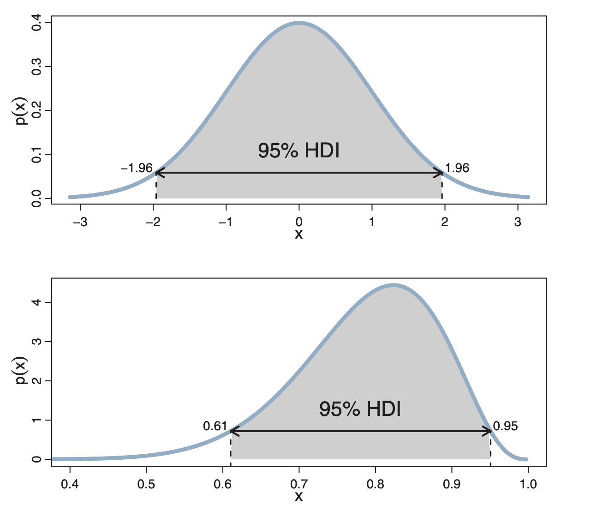
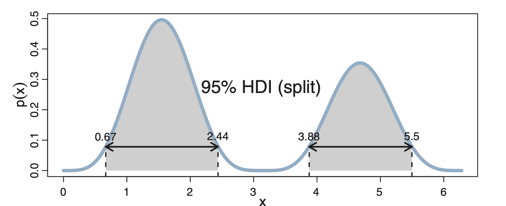

```{r setup, include=FALSE}
library(reticulate)
use_condaenv("r-reticulate")
```

```{python, echo=FALSE}
import numpy as np
import pandas as pd
import arviz as az
import scipy.stats as stats
from matplotlib import pyplot as plt
import seaborn as sns
sns.set_theme()
plt.rcParams.update({
    "text.usetex": True,
    "font.family": "sans-serif",
    "font.sans-serif": ["Helvetica"]})
az.style.use('arviz-darkgrid')
```

# Analysis of the results - 1

* The result of the Bayesian analysis is the posterior  distribution of $\theta$,  **not** a single value.

* The dispersion of the posterior distribution (posterior variance) is a measure of  uncertainty.

* The uncertainty decreases when the number of experiments is greater.

# The impact of the prior 
* Given a _sufficient_ amount of data, the posterior will be practically the same  with any prior.

* Given a limited amount of data, the posterior obtained by different priors can be significantly different; it makes sense to repeat the analysis with different prior if you are unsure.

* The priors impact the results of our calculations. This makes  sense, since  we  use the prior to encode our previous knowledge and different experts have different opinions. 

* How much data is needed for the prior effect to be negligible varies with the problem.


# Discussion
* Priors and likelihood are based on assumptions and are  part of the model.

* *Slightly informative*  priors are recommended.
In many problems we know at least something about the possible values that our parameters can take, for example that they can only be positive, or that they are restricted to sum to 1 or the approximate range, etc. 

* A Beta(1,1) prior is flat but  limits the   values of $\theta$ between 0 and 1.

* If we had more than one reasonable prior, we could perform a sensitivity analysis, that is, evaluate if the results significantly change with the priors, or instead the data are strong enough to overwhelm the prior.

# Summarizing the posterior
*  Different measures can be used to summarize the a priori:
  * the mean (or the mode, or the median) of the posterior distribution
  * the  probability of $\theta$ belonging to a certain interval
  * the HPD, also called the *credibility* interval. 
  
# Example: inference on the bias $\theta$ of the coin


* Let us consider a uniform prior, Beta(1,1)
* Let us assume the data are $y$=8 heads out of  $n$=18 tosses.
```{python, echo=FALSE, fig.height=1, fig.align='center'}
plt.figure(figsize=(10, 3))
x = np.linspace(0, 1, 200)
heads=10
tails= 8
for ind, (a, b) in enumerate([(1, 1)]):
    y = stats.beta.pdf(x, a+heads, b+tails)
    plt.subplot(1, 3, ind+1)
    plt.plot(x, y, linewidth=2)
    plt.title('Beta(%s+%s , %s+%s)' % (a,heads,b,tails))
```

* The posterior mean is $E_{\text{post}}=\frac{1+8}{1+18}=0.474$

# Probability of the coin being almost fair

```{python, echo=FALSE, fig.height=1, fig.align='center'}
plt.figure(figsize=(10, 3))
x = np.linspace(0, 1, 200)
heads=10
tails= 8
for ind, (a, b) in enumerate([(1, 1)]):
    y = stats.beta.pdf(x, a+heads, b+tails)
    plt.subplot(1, 3, ind+1)
    plt.plot(x, y, linewidth=2)
    plt.title('Beta(%s+%s , %s+%s)' % (a,heads,b,tails))
```

$$ p_{\text{post}} = 0.49 \leq \theta \leq 0.51 = \int_{0.49}^{0.51} p_{\text{post}}(\theta) d\theta $$
```{python, echo=TRUE, fig.align='center'}
from scipy.stats import beta
beta.cdf(0.51, 9, 19) - beta.cdf(0.49, 9, 11)
```


# Highest Density Interval (HDI)   

* The HDI indicates which points of a distribution are most credible. 

* The  HDI is the shortest interval that contains a chosen portion of the probability density, usually 95% (although other values such as 90% or 50% are common). 

* Any point within this interval has a higher density than any point outside the interval. For a unimodal distribution, the HDI 95 is  the interval between the 2.5th and 97.5th percentiles.

* The HDI is also referred to as HPD (high posterior density) in some books. 


# HDI   of unimodal distributions

```{r, out.width='45%', fig.align='center', echo=FALSE}

```

* The height of the horizontal arrow marks the minimal density exceeded by all $x$ values inside the 95% HDI


# HDI of bimodal distribution
```{r, out.width='45%', fig.align='center', echo=FALSE}

```

* The HDI is split into two sub-intervals, one for each mode of the distribution. 

* The  characteristics are as before: 
  * The shaded area has total area of 0.95.
  * Any $x$ within such limits has higher probability density than any $x$ outside the limits.


<!-- # Reporting the posterior with Arviz -->
<!-- * ArviZ is a Python package which provides functions to summarize the  posterior. The function *plot_posterior* can be used to generate a plot with mean and HPD.  -->

<!-- # Example -->
<!-- ```{python, echo=TRUE, fig.height=2.5} -->
<!-- import arviz as az -->
<!-- #We used randomly generated data according to a beta distribution as our posterior. -->
<!-- mock_posterior = stats.beta.rvs(5,11, size=1000) -->

<!-- az.plot_posterior (mock_posterior,  -->
<!--   figsize=(8, 4)) -->
<!-- ``` -->


# Posterior Predictive Checks

* The  posterior is used to generate data $\tilde{y}$ that are compared to the already observed data $y$.

$$
p(\tilde{y} \mid y) = \int p(\tilde{y} \mid \theta) p(\theta \mid y) d\theta
$$

* This represents  data that are expected to be seen in a future experiment.

* The test consists of comparing the observed data with the data predicted from the posterior, to assess the consistency of the model.

* We will see examples of posterior predictive checks  later in the course.


# Conclusions
* We have a finite sample of data, on which we perform a Bayesian inference obtaining a posterior distribution.
This  is the central object of Bayesian statistics since it contains all the information about a problem (given the model and the data).

* One way to evaluate a model is to compare the _posteriori_ predictive distribution to the finite sample we got in the first place.

* While the posterior distribution is a distribution **over parameters**, the posterior predictive distribution is **over the (predicted)** data.


# Possible exercises
Use the following function to explore various combinations of _priors_ and _likelihoods_. State the conclusions that you consider most relevant. 

```{python, echo=TRUE}
def posterior_grid (grid=10, a=1, b=1, tails=6, flips=9):
    grid = np.linspace(0, 1, grid)
    prior = stats.beta(a, b).pdf(grid)
    likelihood = stats.binom.pmf(tails, flips, grid)
    posterior = likelihood * prior
    posterior /= posterior.sum()
    _, ax = plt.subplots(1, 3, sharex=True, figsize=(16, 4))
    ax[0].set_title('tails = {}\nflips = {}'.format(tails, flips))
    for i, (e, e_n) in enumerate(zip([prior, likelihood, posterior], ['a priori', 'likelihood', 'a posteriori'])):
        ax[i].set_yticks([])
        ax[i].plot(grid, e, 'o-', label=e_n)
        ax[i].legend(fontsize=14)

```