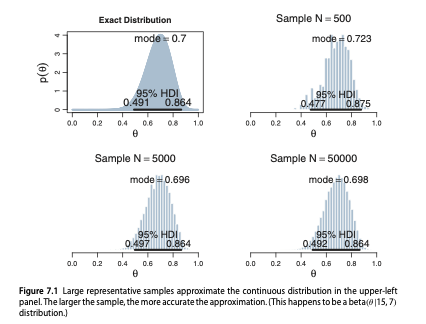
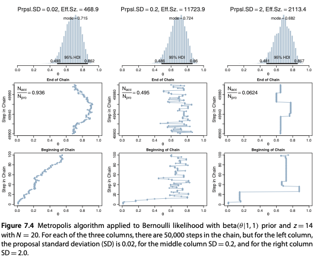

```{r setup, include=FALSE}
library(reticulate)
library(png)
use_condaenv("r-reticulate")
```

```{python, echo=FALSE}
import numpy as np
import pandas as pd
import arviz as az
import scipy.stats as stats
from matplotlib import pyplot as plt
import seaborn as sns
sns.set_theme()
plt.rcParams.update({
    "text.usetex": True,
    "font.family": "sans-serif",
    "font.sans-serif": ["Helvetica"]})
az.style.use('arviz-darkgrid')
```

# Non-conjugate likelihood

* Generally the likelihood is **not**  conjugate to the prior.

* Grid approximation  does not scale. 

* If we need to compute the joint distribution of 6 parameters, each represented by 1000 states, we have $1000^6$ states, too much for any computer.

# MCMC

* MCMC methods address this type of problems. For simplicity, we show  a single-parameter problem.

* We do assume the prior $p(\theta)$ and the likelihood $p(D \mid \theta)$ to be given.

* The method avoids the direct evaluation of the difficult integral in the denominator of Bayes’ rule:

\begin{align}
p(\theta \mid D) = \frac{p(\theta) p(D \mid \theta)}{\int p(\theta) p(D \mid \theta) d\theta}
\end{align}

* The method  approximates  the posterior of $\theta$
by returning many samples.

#  Approximating a distribution with a (large) sample

* By randomly sampling a subset of people from a population, we can estimate the underlying tendencies in the entire population. 

* The larger the sample, the better the estimation. 

* The population from which we want to  sample is the **posterior distribution of $\theta$**.

#  Approximating a distribution with a sample



* we can approximate the exact values by randomly sampling a large number of  values from the distribution;

* larger sample sizes yield a smoother and more accurate  histogram;

* The exact values were obtained from the mathematical formula of the beta distribution. 


# The Metropolis algorithm: a simple example. 

* We live in a chain of 7 islands.
* We have to do many travels, visiting  each  island proportionally to its population.
* We can move from an island to a neighboring one, or remain on the same island.
* The population of the different islands is 1000, 2000, 3000, ...,7000.


# Making decisions

* Flip a coin to decide whether the *proposed* island is located east or west.
* If the proposed island has a larger population than the current one: 
  * visit it.
* Otherwise:
  * visit it with probability 
$p_{\text{move}} = \frac{p_{\text{proposed}}}{p_{\text{current}}}$ 
* In the long run, each  island is visited proportionally to its population!

# Discussion 
* At each time step, both the chosen direction and its acceptance are random. 

* If the process were started over again, the specific trajectory would be  different. 

* Yet, in the long run the relative frequency of visits mimics in any case the target distribution.

# Proposal
* We are  at position $\theta_{\text{current}}$. 
* We randomly propose to move right (50\%) or left (50\%). 
*  The possible  moves and the probability of proposing each is the *proposal distribution*. 
* Our proposal distribution has only two values (left and right) with 50-50 probabilities.

# Accepting the proposal
* If the target distribution is greater at the proposed position,  we  accept the proposed move. 
  * we always move higher if we can.
* Otherwise we check  the ratio between the value of the target distribution at the proposed position and at the current position.

*  On the other hand, if the target distribution is less at the proposed position than at our current position, we accept the move with probability:

$$p_{\text{move}} = \frac{p_{\text{proposed}}}{p_{\text{current}}}$$ 

* We thus  move to the proposed position with probability:
$$ p_{\text{move}} = min \left(  \frac {p(\theta_{\text{proposed}})} {p(\theta_{\text{current}})}, 1 \right) $$

# We use the *unnormalized* posterior

* The algorithm requires evaluating the ratio 
$\frac{p(\theta_{\text{proposed}})}{p(\theta_{\text{current}})}$,
which does not require computing the normalizing constant (i.e., the denominator) of Bayes rule. 

* It does not require the 
 absolute value of $p(\theta)$, but only the ratio between the density in different locations.

* We can thus sample from $p(\theta)p(D|\theta)$ without normalizing it by the (often) untractable marginal likelihood $p(D)$.
 
* In the example of  islands-hopping, the target distribution was the unnormalized population of each island, not a normalized probability.


# Discussion
* We have a target distribution from which we would to sample.
* Usually our target distribution is the unnormalized posterior distribution of $\theta$: the product of the likelihood and the prior, i.e., $p(\theta)p(D|\theta)$.
* Extensions for continuous values (see the following).
* Extenions for any number of dimensions (not covered).

# Random walk
* The samples from the posterior are generated by taking a *random walk*
* The walk starts from a randomly chosen point where the distribution is non zero.
* At each time step we propose the move to a new position $\theta_{\text{proposed}}$.
* We then decide whether or not to accept the proposed move.
* The move is accepted with probability 
$$ p_{\text{move}} = min \left(  \frac {p(\theta_{\text{proposed}})} {p(\theta_{\text{current}})}, 1 \right) $$

#  Metropolis algorithm applied to Bernoulli likelihood and beta prior
$p(\theta \mid D) \propto p(D \mid \theta) p(\theta) = \theta^{a+y} (1-\theta)^{b+n-y}$

*  $\theta$ is a continuous parameter
*  For the proposal distribution, we use $\Delta \theta \sim N(0, \sigma)$
*  Thus $\theta_{\text{proposed}}$ is larger or smaller than  $\theta_{\text{current}}$ with equal probability
* The proposed $\theta_{\text{proposed}}$ generally lies in an interval of $\pm 3 \sigma$ around $\theta_{\text{current}}$. 
* Hence $\sigma$ controls how far $\theta_{\text{proposed}}$  can be from $\theta_{\text{current}}$.

#  Sampling Bernoulli likelihood and beta prior

Start from $\theta_0$.

At each iteration:

* Draw $\Delta \theta \sim N(0, \sigma)$
* $\theta_{\text{proposed}} = \theta_{\text{current}} + \Delta \theta$

# Probability of the move

We move to $\theta_{\text{proposed}}$ with probability:

\begin{align*}
p & = \min \left( 1, \frac{P(\theta_{\text{proposed}} \mid D)}{P(\theta_{\text{current}} \mid D)}  \right) \\
& = \min \left( 1, \frac{\theta_{proposed}^{a+y} (1-\theta_{proposed})^{b+n-y}}{\theta_{current}^{a+y} (1-\theta_{current})^{b+n-y}}  \right) 
\end{align*}

# Application 
* Consider the prior $p(\theta)= Beta(1, 1)$
* The Bernoulli likelihood $\theta^{14} (1-\theta^{6})$ corresponding to 20 tosses and 14 tails.
* The three columns use three different $\sigma$ in the proposal distribution. 

# Results


* The probability of accepting a jump is  $\frac{N_{\text{acc}}} {N_{\text{pro}}}$

* It decreases when $\sigma$ gets larger.

* Central column: smooth histogram. Yet, each step is correlated to the previous one. 

* These are not 50,000 independent samples of the posterior. 

* The *effective samples size* is  11723.9. This is the equivalent number of samples if they were sampled independently of each other (as the sampling is a sequential process, some auto-correlation in the samples is generally present).

# Left column (small $\sigma$)

*  The left column uses a the small $\sigma$ = 0.02.
* The successive steps in the chain make small moves
* The chain will  require a very long chain to thorouhgly explore the posterior distribution.
* The effective size of this 50,000 step chain is only 468.9.

# Right column (large $\sigma$)

* The proposed jumps are often far away from the bulk of the posterior distribution; the proposals are often rejected.

* The process accepts new values only occasionally, producing a very clumpy chain. 

* In the long run, the chain will explore the posterior distribution thoroughly and produce a good representation, but it will require a very long chain. 

* The effective size of this 50,000 step chain is only 2113.4.

* An acceptance ratio of about 0.5 usually provides the best effective sample size.

* Advanced implementations of the Metropolis algorithm  automatically  adjust the width of the proposal distribution.

# Exercises 

* Implement the island hopping algorithm? vedi codice in scripts
* Replicate the experiment about sampling the posterior beta.
* Replicate the experiment with a non-conjugate prior (triangular??).