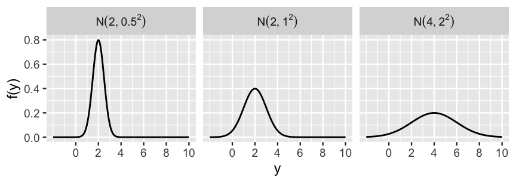
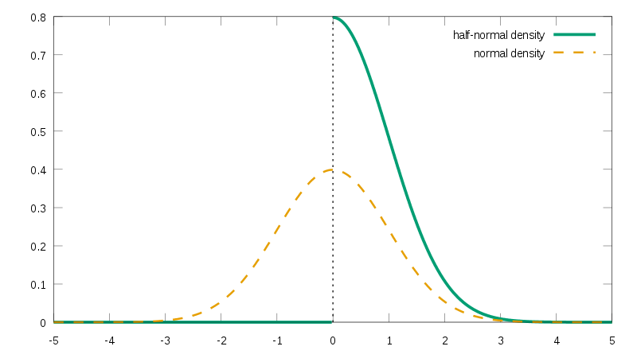

```{r setup, include=FALSE}
library(reticulate)
```

```{python, echo=FALSE}
import numpy as np
import pandas as pd
import arviz as az
import scipy.stats as stats
from matplotlib import pyplot as plt
from scipy.stats import norm
from scipy.stats import halfnorm
import seaborn as sns
sns.set_theme()
plt.rcParams.update({
    "text.usetex": True,
    "font.family": "sans-serif",
    "font.sans-serif": ["Helvetica"]})
az.style.use('arviz-darkgrid')
```

# Credits

* Chap. 5 of *Bayes Rules! An Introduction to Applied Bayesian Modeling*
  * https://www.bayesrulesbook.com/chapter-5.html


# The Normal model

* Let $Y$  be a continuous random variable which can take  values in (−$\infty$,$\infty$)  

\bigskip

* The variability of Y might be well represented by a Normal model 
 $$Y ∼ N(\mu,\sigma^2)$$


# The Normal model

* The Normal pdf is 

$$ f(y) = \frac{1}{\sqrt{2\pi\sigma^2}} \exp\bigg[{-\frac{(y-\mu)^2}{2\sigma^2}}\bigg] $$

\bigskip

* With:

\begin{align*}
E(Y) &= Mode(Y)=μ \\
Var(Y) &= \sigma^2 \\
SD(Y) &= \sigma
\end{align*}

# Standard deviation $\sigma$

* $\sigma$ provides a sense of scale for $Y$. 

\bigskip

* Roughly 95% of $Y$ values are within 2 standard deviations of $\mu$:
$$\mu \pm 2 \sigma$$

\bigskip 

* Roughly 99% of $Y$ values are within 3 standard deviations of $\mu$:
$$\mu \pm 3 \sigma$$

# The normal model

* The Normal model is bell-shaped and symmetric around $\mu$. 

\bigskip

* As σ gets larger, the pdf becomes more spread out.

\bigskip
* Though a Normal variable is defined in (−∞, ∞), the   plausibility of values that are more than 3 standard deviations σ from the mean $\mu$ is negligible.

```{r figurename, echo=FALSE, out.width = '75%'}

```

# Example


* The  volume of the hippocampus (a part of the brain)  is  researched in studies about the effect of concussions.

\bigskip

* In the general population, both halves of the hippocampus have a volume between 3.0 and 3.5 cm$^3$.

\bigskip

* Thus, the  hippocampal volume is thought to vary, within the population,  between 6 and 7 cm$^3$.

\bigskip

* The average volume $\mu$ is thought to be between 6.4  and 6.6 cm$^3$.


# Normal prior

* Assuming  symmetry, we  formalize our  prior information about $\mu$ as:

\begin{align*}
\mu & \sim N(\mu', \sigma_{\mu})\\
\text{which in this example yields :} \\
\mu & \sim N(6.5, 0.05)\\
\end{align*}


*  $\mu'$ is our prior guess on the value of $\mu$.

\bigskip

*  $\sigma_{\mu}$ represents our uncertainty on the guess $\mu'$.


\bigskip

* According to this prior, $\mu$ lies with 95% probability in (6.4, 6.6). 

\bigskip
 
* We allow the volume to range over ($-\infty, \infty$), but values  beyond $\mu \pm 3 \sigma$ are given negligible probability.

# Normal prior

\bigskip

* There is no single right prior, but different reasonable priors.


# Normal likelihood

* We now define a model for the distribution of 
 the observations.

\bigskip


* We make a *second* assumption of normality.

\bigskip

* The hyppocampal volumes observed in $n$ subjects ($y_1,y_2,…,y_n$) are  normally distributed $N(\mu, \sigma)$.

# Normal likelihood

* $\mu$ is the mean volume in the population.


\bigskip

* $\sigma$ expresses the spread of the measures within the population.

\bigskip

* We expect $y$ to vary in (6-7); we interpret this interval as $\mu \pm 2\sigma$, hence it has length of 4$\sigma$.

\bigskip

* We thus set $\sigma$=0.25.


# Independence 

* We morever assume the observations $y_1, ..., y_n$ to be *independent* samples from $N(\mu, \sigma)$.

\bigskip

* This is realistic: the measure $y_i$ tells us nothing about  the measure $y_{i+1}$ (assuming they refer to different subjects)

# Likelihood

Assuming independence, the joint pdf of the $n$ measures ($y_1,y_2,…,y_n$) is the product of the unique Normal pdfs $f(y_i \mid \mu)$:

$$
f(\vec{y} | \mu) = \prod_{i=1}^{n}f(y_i|\mu) = \prod_{i=1}^{n}\frac{1}{\sqrt{2\pi\sigma^2}} \exp\bigg[{-\frac{(y_i-\mu)^2}{2\sigma^2}}\bigg]  .
$$
\bigskip

*  $\vec{y}$ is the vector containing the measures $y_1,....y_n$.


# The Normal-Normal  model

\begin{align*}
\mu & \sim N(\mu', \sigma_{\mu}) \\
\vec{y} & \sim N(\mu, \sigma) \\
\end{align*}

* We treat $\mu'$, $\sigma_{\mu}$ and $\sigma$ as fixed numbers. 

\bigskip

* The only parameter of the model is  $\mu$. 

\bigskip

* Later we will treat also $\sigma$ as a parameter. 

# Your turn: normal likelihood functions

* For a Normal random sample $y_i \sim N(μ,σ)$ with $\sigma$=10 we observe:  

$$y_1,y_2,y_3=(−4.3, 0.7, −19.4)$$ 


* Specify and plot the corresponding likelihood function of $\mu$.


# Conjugacy of the normal-normal model

* Denote the sample mean as  $\bar{y} = \frac{1}{n} \sum_i y_i$.

\bigskip

* The posterior density of $\mu$ is 
 normal with updated parameters:

$$
\mu|\vec{y} \; \sim \;  N\bigg(
\underbrace{
\mu'\frac{\sigma^2}{n\sigma_{\mu}^2+\sigma^2} + \bar{y}\frac{n\sigma_{\mu}^2}{n\sigma_{\mu}^2+\sigma^2}}_{\text{posterior mean}}, 
\underbrace{
\; \frac{\sigma_{\mu}^2\sigma^2}{n\sigma_{\mu}^2+\sigma^2}\bigg)}_{\text{posterior variance}}  .
$$

# Posterior mean

$$
\mu|\vec{y} \; \sim \;  N\bigg(\mu'\frac{\sigma^2}{n\sigma_{\mu}^2+\sigma^2} + \bar{y}\frac{n\sigma_{\mu}^2}{n\sigma_{\mu}^2+\sigma^2}, \; \frac{\sigma_{\mu}^2\sigma^2}{n\sigma_{\mu}^2+\sigma^2}\bigg)  .
$$
\bigskip

* The posterior mean is a weighted average of the prior mean $\mu'$ and the sample mean $\bar{y}$.


\bigskip

* As $n$ increases, the posterior mean converges to $\bar{y}$.

\bigskip

* As $n$ increases, the posterior variance decreases.

# Your turn

*  Which is the posterior mean,  if we did  5 measures with $\bar{y}=6.7$?

\bigskip

*  Which is the posterior mean,  if we did  35 measures with $\bar{y}=6.7$?


# Your turn

* Let $\mu$ be the average 3 p.m. temperature in Lugano.

\bigskip

* Your friend’s prior understanding is that $\mu$ is around 15 degrees Celsius, though might be anywhere between 5 and 25 degrees. 

\bigskip


* To learn about $\mu$, he will analyze 1000 days of temperature data. 

\bigskip

* Letting $y_i$ denote the 3 p.m. temperature on day $i$, they’ll assume that daily temperatures vary Normally around $\mu$ with a standard deviation of 5 degrees.

\bigskip

* Formalize a  normal-normal model.


#  Treating $\sigma$ as a parameter

*  A more sophisticated approach is to treat $\sigma$ as a parameter.

\bigskip

* We assigning a prior to it; it should cover a wide range of plausible values for $\sigma$, leaving out however values that make no sense.

\bigskip

* In this case there is no closed-form expression of the posterior.

# Half-normal distribution 

*  $\sigma$ is strictly positive; a suitable prior is the *half-normal* distribution.

\bigskip

* The half-normal is  a Gaussian  restricted to positive values.

\bigskip

* Sample $s$ from a half-normal are obtained by:
  * sampling from a normal distribution 
  * applying the absolute value to the  sampled values
  * $s \sim |N(0, \xi)|$, where $\xi$ is the standard deviation of the underlying normal. It is referred to as the *scale* of the half-normal.


# The half-normal distribution

* The HN pdf is asymmetric and right-skewed.

\bigskip


* It has long tails which are much larger than the median.

\bigskip


```{r, echo=FALSE, out.width = '75%', fig.cap= "from wikipedia"}

```


# Effect of the scale parameter

* The half-normal pdf is characterized by a scale parameter (the standard deviation of the underlying normal).

```{python, echo=FALSE, fig.height=2, fig.align="center"}
plt.figure(figsize=(10, 3))


x = np.linspace(-2,5, 100)

#at each x we plot the pdf of the halfnorm with different scales
plt.plot(x, halfnorm.pdf(x, scale=1), 'r-', lw=3, alpha=0.6, label='scale: 1')
plt.plot(x, halfnorm.pdf(x, scale=3), 'b-', lw=3, alpha=0.6, label='scale: 3');
plt.plot(x, halfnorm.pdf(x, scale=6), 'g-', lw=3, alpha=0.6, label='scale: 6');
plt.legend()

```


# Tuning the half-normal distribution

* You can tune the scale of the HN by considering  a plausible value of $\sigma$, and choose the scale so that it is close to the median of the HN.

\bigskip

* E.g., assume  a plausible value of $\sigma$  is 7.5.

\bigskip

  * With 95% probability the measures are lie in an interval of $\pm 15$ around the mean.

\bigskip

  * But we are uncertain about this statement, as the interval could be well of $\pm 30$ .


# Tuning the half-normal distribution

* We try different scales, until the median is about 7.5.

\bigskip    

* Notice the long tails of the distribution, which allows to model to correct if our prior median guess (7.5) is underestimated.  

```{python, echo=TRUE, fig.height=2, fig.align="center"}
pd.DataFrame(halfnorm.rvs(size=1000, scale=11)).describe()
```
# Probabilistic model with $\sigma$ as parameter

\begin{align*}
\mu &\sim N(\mu_{\mu}, \sigma_{\mu}) && \text{prior beliefs about } \mu\\ 
\sigma &\sim \text{Half-Normal}(\sigma_{\sigma}) && \text{prior beliefs about } \sigma \\
y & \sim N(\mu, \sigma) && \text{the observation are  normally distributed} \sigma\\
\end{align*}


* We cannot treat this model analytically, as the prior are no longer conjugates.

\bigskip

* We will implement it later via probabilistic programming.

# Conceptual exercise

* Try to define  a probabilistic model of the distribution of height of adult males in Switzerland 

# Prior for  $\mu$


* The mean height of the population could  be 175. 

\bigskip 

* Keeping our prior broad,  we state the mean height of the population to lie with 99% probability between 160 and 190 cm (the 99% interval roughly corresponds to $\mu \pm 3 \sigma$).
  
  \bigskip
  
  * $\mu \sim N(175, 5)$ 
  
# Prior for $\sigma$


* We shall now assign a prior to $\sigma$. Within the  population, we assume the height   to lie with 99% probability between 100 and 250 (broad but realistic range). 

\bigskip

  * Hence the corresponding value of the standard deviation is (250-100)/6 = 25.
    
  
  \bigskip
    
  
# Tuning the half-normal

* A half-normal distribution with scale 35 has roughly  median 25:


```{python, echo=TRUE, fig.height=2, fig.align="center"}
pd.DataFrame(halfnorm.rvs(size=1000, scale=35)).describe()
```

# Likelihood (distribution of the data)

* Under the assumption of normality and independence, the likelihood is:
$$y  \sim \mathcal{N}(\mu, \sigma)$$

\bigskip

* No further specification is required. 


# The resulting model

\begin{align*}
\mu & \sim N(175, 5) \\
\sigma & \sim \text{half-normal}(35) \\
\vec{y} & \sim N(\mu, \sigma) \\
\end{align*}


# Solution for the exercise on normal likelihood functions

* Compute the likelihood as a function of $\mu$ for a normal  sample  with $\sigma$=10, given the observations:  

$$y_1,y_2,y_3=(−4.3, 0.7, −19.4)$$ 

# Solution

\tiny

```{python, echo=TRUE, fig.height=2, fig.align="center", cache=TRUE}
#based on the observations, plausible values of mu
#range between -30 and 20.
mu = np.arange(-30, 20, 0.5)
sigma = 10

#a likelihood value for each value of mu
lik = norm.pdf(-4.3, loc=mu, scale=sigma)

#under independence, the likelihood of each observation multiplies
lik = lik * norm.pdf(0.7, loc=mu, scale=sigma)
lik = lik * norm.pdf(-19.4, loc=mu, scale=sigma)

plt.figure(figsize=(10, 3))
plt.plot(mu, lik)
```

# Solution

* The values in the previous slide are numerically small. With more data, and more likelihood multiplication, it will become numerically untractable.

\bigskip

* For this reason it is numerically better to work with the log of the likelihood (log-likelihood).


